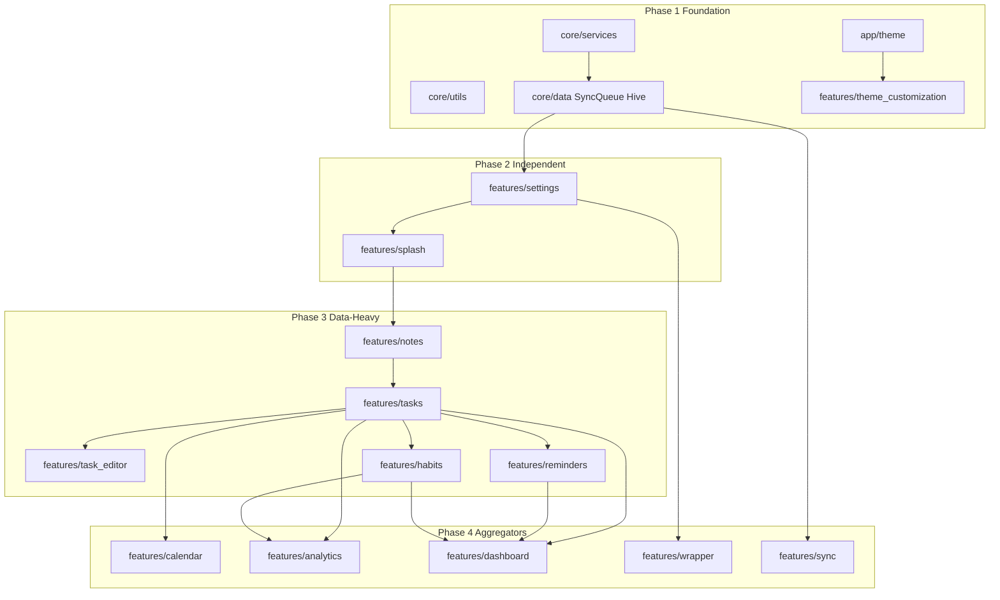

# Nexus Clean Architecture Migration Plan

> Migration from Feature-first MVC to Feature-first Clean Architecture.  
> **State:** Provider + ChangeNotifier only. **Sync:** Offline-first; SyncQueue must be preserved.

---

## Refactoring Rules (Strict Compliance)

1. **Deconstruct Controllers:** Extract business logic from Controllers into **Use Cases** (domain). The remaining Provider/ChangeNotifier handles only UI state (loading/error/success) and calls Use Cases.
2. **Domain vs Data models:** **Domain entities** are pure Dart (no `@HiveType`, no Flutter/UI, no external libs). **Data models** extend entities and add `@HiveType` / JSON; use **Mappers** to convert between them.
3. **SyncQueue:** Keep `SyncOperation` and `SyncService` behavior. Repository implementations (or use cases that need sync) continue to enqueue via `SyncService`. Do not remove or bypass sync logic.
4. **Preserve comments:** Keep all existing comments (e.g. in sync_conflict_detector, sync_backoff, SyncOperationAdapter).
5. **State management:** Provider + ChangeNotifier only. Do not introduce Bloc, Riverpod, or GetX.

---

## Target Feature Structure

```
lib/features/<feature_name>/
  ├── domain/
  │   ├── entities/
  │   ├── repositories/   (abstract interfaces)
  │   └── use_cases/
  ├── data/
  │   ├── models/         (DTOs: @HiveType, extend entities)
  │   ├── repositories/   (implementations)
  │   └── data_sources/
  └── presentation/
      ├── state_management/
      ├── pages/
      └── widgets/
```

---

## Dependency Order (Strict)

Migration must follow this order to avoid dependency breaks.

### Phase 1 — Foundation (Core)

| # | Item | Checklist |
|---|------|-----------|
| 1 | **core/services/ and core/utils/** | [x] No feature imports in core/services (Workmanager reminder logic moved to features/reminders; SyncService uses untyped getConflictStream). [x] Logger, Notifications, sync_backoff in core. [x] Verify build. |
| 2 | **core/data/** (SyncQueue, Hive, adapters) | [x] SyncOperation in core/data; SyncService and handlers use it. [x] HiveBoxes, HiveTypeIds, HiveBootstrap in core. [x] Sync metadata / device_id in core/data. |
| 3 | **app/theme/ and features/theme_customization/** | [x] app/theme has no feature dependencies. [x] theme_customization: presentation/ (pages, widgets); domain use cases (save preset). [x] Depends on settings only. |

### Phase 2 — Independent Features

| # | Item | Checklist |
|---|------|-----------|
| 4 | **features/settings/** | [x] domain/ (entities, SettingsRepository, use cases: LoadSettings, UpdateTheme, etc.). [x] data/ (SettingsRepositoryImpl, store). [x] presentation/ (SettingsController thin → use cases). [x] Update DI. [x] Verify build. |
| 5 | **features/splash/** | [x] AppInitializationResult holds domain repo types. [x] presentation/ (AppInitializer, ProviderFactory) create repos and controllers. [x] Update DI. [x] Verify build. |

### Phase 3 — Data-Heavy Features

| # | Item | Checklist |
|---|------|-----------|
| 6 | **features/notes/** | [x] domain/ (NoteEntity, NoteRepository contract, use cases: CreateEmptyNote, SaveNote, UpdateNoteCategory, DeleteNote, AddNoteAttachment). [x] data/ (NoteRepositoryImpl, mapper, datasource). [x] Sync: enqueue via SyncService. NoteSyncHandler unchanged. [x] presentation/ (NoteController thin → use cases). [x] Update DI. [x] Verify build. |
| 7 | **features/tasks/** | [x] domain/ (Task, Category, TaskAttachment entities, TaskRepository contract, use cases: CreateTask, UpdateTask, DeleteTask, ToggleCompleted, AddTaskAttachment, ClearCategoryOnTasks). [x] data/ (TaskModel, mappers, TaskRepositoryImpl). [x] Sync: TaskSyncHandler unchanged; enqueue via SyncService. [x] presentation/ (TaskController thin → use cases; CategoryController). [x] Update DI. [x] Verify build. |
| 8 | **features/task_editor/** | [x] Depends on tasks (TaskController → use cases). [x] presentation/ only (sheet/dialog uses TaskController). [x] Verify build. |
| 9 | **features/reminders/** | [x] domain/ (Reminder entity, ReminderRepository, use cases: Create, Update, Delete, Complete, Uncomplete, Snooze, CleanupCompleted). [x] data/ (ReminderRepositoryImpl, local datasource). ReminderTimerService in services. [x] presentation/ (ReminderController thin → use cases). [x] Update DI. [x] Verify build. |
| 10 | **features/habits/** | [x] domain/ (Habit, HabitLog entities, repository contracts, use cases: CreateHabit, ToggleHabitToday). [x] data/ (mappers, repository impls). [x] presentation/ (HabitController thin → use cases). [x] Update DI. [x] Verify build. |

### Phase 4 — Aggregators

| # | Item | Checklist |
|---|------|-----------|
| 11 | **features/calendar/** | [x] presentation/ (CalendarController) uses TaskController, ReminderController. [x] Verify build. |
| 12 | **features/analytics/** | [x] presentation/ (AnalyticsController) uses TaskController, HabitController. [x] Verify build. |
| 13 | **features/dashboard/** | [x] presentation/ sections call TaskController, ReminderController, HabitController (which use use cases / repos). [x] Verify build. |
| 14 | **features/wrapper/** | [x] Shell, nav bar, drawer; presentation only. [x] Verify build. |
| 15 | **features/sync/** | [x] SyncController thin: UI state + SyncService. [x] Conflict dialogs enqueue SyncOperation via SyncService. [x] Verify build. |

---

## Dependency Diagram



---

## Per-Feature Checklist Template

Use this template when adding or migrating **new** features (the migration below is complete):

- [ ] Create `domain/` (entities, repository interfaces, use_cases).
- [ ] Create `data/` (models extending entities + @HiveType, mappers, data_sources, repository implementations).
- [ ] Ensure SyncQueue/SyncService usage preserved where applicable (tasks, notes, sync UI).
- [ ] Refactor `presentation/` (state_management = Providers/ChangeNotifiers, pages, widgets).
- [ ] Update DI (ProviderFactory) to register new repos and use cases.
- [ ] Verify build and that no feature behavior is lost.

---

## Next Step

**Migration complete.** All checklist items (Phases 1–4) are done. Core has no feature imports; settings, splash, notes, tasks, task_editor, reminders, habits use domain entities, repository interfaces, use cases, and thin controllers; calendar, analytics, dashboard, wrapper, and sync use the right controllers and SyncService. Final build verified: `flutter build apk --debug` succeeds.
