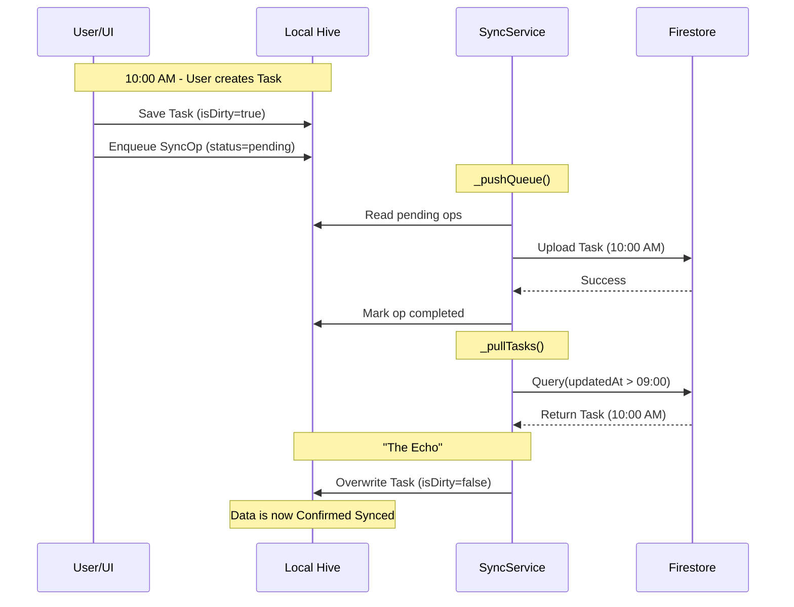

# Nexus — Developer Contributor Guide

Nexus is an **offline-first** personal life management app (Tasks, Reminders, Notes, Habits, Calendar, Analytics) built with **Flutter**.

**Design principle:** Hive is the local source-of-truth. Every user action writes locally first and then syncs to the cloud when possible.

- **Platforms**: Android + Windows
- **UI language**: English-only (hardcoded strings)
- **Arabic support**: user-entered content (Tasks/Notes) auto-renders RTL when text contains Arabic characters

This is the **primary technical walkthrough and reference** for developers
working on Nexus. It is intentionally in-depth and is written to be used both
for onboarding and day-to-day engineering lookup.

## Documentation boundaries

Use the three docs with the following intent:

| Document | Audience | Depth | Purpose |
|----------|----------|-------|---------|
| `README.md` | End users / product readers | Low | Product-facing overview of what Nexus is and what features users get. |
| `docs/nexus_knowledge_base.md` | Engineers and AI assistants | Medium | High-level technical orientation: architecture, stack, dependencies, app structure, key flows. |
| `developer_README.md` (this file) | Engineers implementing changes | High | Deep technical walkthrough, implementation references, operational workflows, and contributor guidance. |

When a topic appears in multiple docs:
- Put **implementation details and change workflow** in this file.
- Put **high-level architecture and system map** in `docs/nexus_knowledge_base.md`.
- Put **user outcomes and feature value** in `README.md`.

## Current engineering snapshot (Apr 2026)

Use this as the “what changed recently” index before diving into deeper sections.

- **Root-navigator notes editor provider scope**
  - `NoteEditorScreen.push(...)` opens editor above shell (`rootNavigator: true`).
  - `NoteEditorScreen.wrapWithRequiredProviders(...)` re-provides `NoteController`, `CategoryController`, and `GoogleDriveService`, and applies caller theme.
  - Files: `lib/features/notes/presentation/pages/note_editor_screen.dart`, `lib/features/notes/presentation/pages/notes_list_screen.dart`, `lib/features/notes/presentation/widgets/tiles/note_tile.dart`.
- **Notes editor UX rework**
  - Overflow options menu moved to anchored top-right overlay.
  - Markdown mode and markdown layout controls moved into overflow menu.
  - Voice notes section is now toggleable.
  - Draggable rich toolbar can lock top/bottom.
  - Category selector toggles inline under title.
  - Files: `lib/features/notes/presentation/widgets/editor/note_editor_overflow_menu.dart`, `lib/features/notes/presentation/widgets/editor/note_editor_view.dart`, `lib/features/notes/presentation/widgets/editor/note_editor_app_bar.dart`, `lib/features/notes/presentation/widgets/editor/widgets/note_editor_body.dart`.
- **Voice transport controls**
  - `VoiceNoteItem` supports play/pause, seek, replay/forward 10s.
  - `VoiceNotesSection` resolves local path with Drive recovery download and caches local URI.
  - Files: `lib/features/notes/presentation/widgets/editor/voice/voice_note_item.dart`, `lib/features/notes/presentation/widgets/editor/voice/voice_notes_section.dart`.
- **Delete-note navigation behavior**
  - Deleting from editor returns to `/notes` after popping editor route.
  - File: `lib/features/notes/presentation/widgets/editor/note_editor_view.dart`.
- **Quill localization at outer app entry**
  - `FlutterQuillLocalizations.delegate` added in `lib/main.dart` to cover root-navigator editor routes.
- **Sync robustness**
  - `SyncService._markFailed` writes through Hive box for detached operations.
  - Files: `lib/core/services/sync/sync_service.dart`, `test/unit/sync/sync_service_test.dart`.
- **Provider regression tests**
  - Root-navigator notes editor provider test.
  - Imperative route provider smoke test.
  - Shell screen provider smoke tests with full provider stack.
  - Files: `test/widget/notes/note_editor_screen_push_test.dart`, `test/widget/screens/imperative_route_provider_test.dart`, `test/widget/screens/shell_screen_provider_test.dart`, `test/helpers/test_hive_all_boxes.dart`.
- **Splash and branding fallback updates**
  - Brand image fallback behavior and splash error-state robustness.
  - Files: `lib/features/splash/presentation/pages/splash_screen.dart`, `lib/features/splash/presentation/widgets/nexus_splash_logo.dart`, `pubspec.yaml`.
- **Android notification reliability hardening**
  - Added `ScheduledNotificationReceiver` (alarm delivery when terminated) and `ScheduledNotificationBootReceiver` (reboot reschedule) to manifest.
  - Added `REQUEST_IGNORE_BATTERY_OPTIMIZATIONS` permission and runtime exemption request with user-facing explanation dialog on first launch.
  - Switched notification icon from `@mipmap/ic_launcher` to custom `ic_notification` white silhouette in all drawable density folders.
  - Merged notification + battery optimization permissions into a single "Reminders" button in Settings > Permissions.
- **Notification dedup: `notifiedAt` field**
  - Added `notifiedAt` (`DateTime?`, Hive field 12) to `Reminder` model and `ReminderEntity`.
  - All delivery paths (SmartTimer, Workmanager) stamp `notifiedAt` after showing a notification.
  - Workmanager and SmartTimer skip reminders where `notifiedAt != null`, preventing re-triggers after dismiss.
  - Snooze (notification action + UI use case), update (new time), and uncomplete all clear `notifiedAt` so the rescheduled alarm fires fresh.
  - Bumped notification channel ID to `nexus_reminders_v2` so existing installs pick up the new action buttons.
  - Files: `lib/features/reminders/data/models/reminder.dart`, `lib/features/reminders/domain/entities/reminder_entity.dart`, `lib/features/reminders/data/mappers/reminder_mapper.dart`, `lib/features/reminders/domain/repositories/reminder_repository_interface.dart`, `lib/features/reminders/data/repositories/reminder_repository_impl.dart`, `lib/features/reminders/data/services/reminder_workmanager_callback.dart`, `lib/features/reminders/data/services/reminder_timer_service.dart`, `lib/core/services/notifications/notification_service.dart`.
  - Files: `android/app/src/main/AndroidManifest.xml`, `lib/core/services/notifications/notification_service.dart`, `lib/core/services/notifications/battery_optimization_dialog.dart`, `lib/core/services/notifications/battery_optimization_first_launch_prompt.dart`, `lib/features/splash/presentation/pages/splash_wrapper.dart`, `lib/features/settings/presentation/widgets/sections/permissions_section.dart`.

## Table of contents

- [Current engineering snapshot (Apr 2026)](#current-engineering-snapshot-apr-2026)
- [1. Getting started](#1-getting-started-step-by-step)
- [2. High-level architecture](#2-high-level-architecture)
- [3. Repository map](#3-repository-map-where-everything-lives)
- [4. App Shell & Navigation](#4-app-shell--navigation-libfeatureswrapper)
- [5. Dashboard](#5-dashboard-libfeaturesdashboard)
- [6. Firebase (Firestore sync)](#6-firebase-firestore-sync--setup--layout)
- [7. Google Drive (attachments)](#7-google-drive-attachments--setup)
- [8. Secret debug logs](#8-secret-debug-logs-production-only--android--windows)
- [9. Feature-by-feature guide](#9-feature-by-feature-guide)
  - [9.1 Tasks](#91-tasks)
  - [9.2 Reminders](#92-reminders)
  - [9.3 Sync + conflict handling](#93-sync--conflict-handling)
  - [9.4 Notes](#94-notes-rich-text--inline-voice-notes)
  - [9.5 Habits](#95-habits)
  - [9.6 Analytics](#96-analytics)
  - [9.7 Calendar](#97-calendar)
  - [9.8 Settings](#98-settings)
  - [9.9 Theme Customization](#99-theme-customization-libfeaturestheme_customization)
- [10. Testing + CI](#10-testing--ci)
- [11. Contributor workflow](#11-contributor-workflow)
- [12. Deep architecture & implementation guide](#12-deep-architecture--implementation-guide)
  - [12.1 Background services deep dive](#121-background-services-deep-dive)
  - [12.2 Feature deep dives](#122-feature-deep-dives)
  - [12.3 How to implement common changes](#123-how-to-implement-common-changes)
  - [12.4 Coding style & project conventions](#124-coding-style--project-conventions)
  - [12.5 Glossary](#125-glossary-quick-reference)

## 1. Getting started (step-by-step)

### 1) Install dependencies

```bash
flutter pub get
```

### 2) Run static checks

```bash
flutter analyze; flutter test
```

### 3) Build artifacts (per project workflow rules)

```bash
flutter build apk; flutter build windows
```

### 4) Regenerate launcher icons (optional)

When you change app icon or splash assets in [`assets/app_logos/`](assets/app_logos/) or the `flutter_launcher_icons` section in `pubspec.yaml`, regenerate the Android launcher and adaptive icons:

```bash
dart run flutter_launcher_icons
```

This overwrites the default and adaptive Android launcher icons under `android/app/src/main/res/` (mipmap drawables and `mipmap-anydpi-v26` XML). It does **not** run as part of CI; run it manually whenever you update the icon assets or config.

### 5) JDK for Android Gradle (optional)

Android builds and `./gradlew signingReport` require a JDK that Kotlin’s tooling supports (e.g. JDK 17). If you have **JDK 25** (or similar) as default and see errors like `IllegalArgumentException: 25.0.1` when running `gradlew signingReport`, point Gradle at JDK 17:

- **Option A:** Set `org.gradle.java.home` in [`android/gradle.properties`](android/gradle.properties) to your JDK 17 install path (e.g. `C:/Program Files/Eclipse Adoptium/jdk-17.0.13.11-hotspot`). Adjust the path to match your machine.
- **Option B:** Before running Gradle, set `JAVA_HOME` to the JDK 17 directory (e.g. in PowerShell: `$env:JAVA_HOME = "C:\Program Files\Eclipse Adoptium\jdk-17.0.13.11-hotspot"`).

### 6) Package name change and local-only data

Changing the Android application id (e.g. from `com.example.nexus` to `com.life.nexus`) gives the app a **new data directory**. The new install cannot see the old app’s files, so:

- **Hive** (and any other app-local storage) starts **empty** in the new install.
- Data that is **only stored locally** and not synced to Firebase is **lost** on reinstall or after a package-name change.

Currently **categories** are local-only (no Firestore sync). So custom category names and structure are lost when you migrate to a new Firebase project and change the package name, or when you reinstall the app. Tasks, notes, and reminders that are synced to Firebase can be restored after signing in; category names cannot unless we add a category sync pipeline. See [Feature sync status](lib\docs\feature_sync_status.md) and the Firebase user data model doc for details.

**Recovering categories from the old package (if the old app’s data still exists):**

1. **If the old app (e.g. `com.example.nexus`) is still installed** on the same device: Build the current app with the **old** application id (temporarily change `applicationId` in `android/app/build.gradle.kts` back to the old value). Install and run it — it will use the old app’s data directory and load the old Hive data. In **Settings → Categories backup**, tap **Export categories**. Use the share sheet to save the JSON file (e.g. to Drive or email). Then reinstall the app with the **new** package name and in **Settings → Categories backup** tap **Import categories** and pick the saved file. Category ids are preserved, so existing tasks will again show under the correct category names.

2. **If the old app was already uninstalled**, the old data directory is usually deleted and the categories cannot be recovered unless you have a backup (e.g. from `adb backup` or a device backup). Export/Import is still useful for future backups.

## 2. High-level architecture

### Offline-first data flow

1) UI triggers an action on a controller (e.g., create task)
2) Controller writes to **Hive** immediately (instant UX)
3) Controller enqueues a **SyncOperation** (local queue)
4) `SyncService` pushes queued ops to Firestore when online
5) `SyncService` pulls remote changes and updates Hive
6) Conflicts are surfaced via conflict dialogs (user chooses local vs remote)

**Local-first write pattern (controller → repo → Hive) (simplified):**

- **Controller layer**: orchestrates user intent and business rules. It validates input, decides *what* should happen (e.g. “create a task and mark it dirty”), calls the repository, and then updates in-memory state and calls `notifyListeners()` so the UI rebuilds. *("Dirty" means the entity has local changes that haven't been synced to the cloud yet—it flags records for the sync queue.)*
- **Repository layer**: acts as a **gateway/abstraction layer** that encapsulates *how* data is stored and fetched. The controller calls simple methods like `upsert` *(insert-or-update: creates a new record if it doesn't exist, or updates it if it does)*, `getAll`, `delete` without knowing whether the data is going to Hive, Firestore, or any other backend. This separation means:
  - **Controller stays focused on business logic**: it decides *what* should happen (e.g., "save this task and mark it dirty") but never deals with Hive box operations, Firestore document writes, or JSON serialization.
  - **Repository handles all storage details**: it knows how to talk to `TaskLocalDatasource` (for Hive) or format data for Firestore sync. It also handles the mapping between Dart models and raw storage formats (Hive objects, JSON, etc.).
  - **Easy to swap or extend**: if you ever need to change how data is stored (e.g., switch databases or add caching), you only modify the repository—controllers remain untouched.
- **Hive**: the on-device database and **source of truth**. Repositories ultimately read/write Hive boxes so all controllers and services see a consistent local state, even while offline.

```dart
// Shape only — method names/types may differ in this project.
Future<void> createTask(Task draft) async {
  // 1) Create a copy with isDirty=true
  final taskToSave = draft.copyWith(isDirty: true);

  // 2) Save to Hive (local source of truth)
  final saved = await _taskRepository.upsert(taskToSave);

  // 3) Enqueue sync operation for background service
  await _syncQueue.enqueue(SyncOperation(
    entityType: 'task', 
    entityId: saved.id
  ));

  // 4) Update UI
  notifyListeners();
}
```

**Why this specific pattern?**

1. **`draft.copyWith(isDirty: true)`**
    - **Immutability**: Models are immutable (Hive/Freezed pattern), so we can't just set `draft.isDirty = true`. We must create a new instance. See [Why Immutable Models?](#why-immutable-models) for details.
    - **Separation of Concerns**: The UI provides the data (title, etc.), but the *Controller* is responsible for marking it as "dirty" (unsynced) before saving.

2. **`SyncOperation` vs. Enqueuing the Task object**
    - **Decoupling**: The background sync service only needs the `ID` and `Type` to know *what* to sync.
    - **Freshness**: When the sync runs later (e.g. when network is restored), it fetches the **latest** version from Hive. If we queued the `draft` object itself, it might be stale by the time the upload happens.

### MVC + Provider

- **Models**: Hive-backed classes (plus Firestore JSON mapping)
- **Controllers**: `ChangeNotifier` (business logic)
- **Views**: screens/widgets
- **Services**: cross-cutting infrastructure

Global providers are composed in splash bootstrap (`SplashWrapper` +
`AppProviderFactory`) and then injected app-wide before `App` mounts the router.

**Typical Provider wiring (simplified):**

```dart
// Shape only — exact providers may differ.
runApp(
  MultiProvider(
    providers: [
      ChangeNotifierProvider(create: (_) => TaskController(/* deps */)),
      ChangeNotifierProvider(create: (_) => ReminderController(/* deps */)),
    ],
    child: const App(),
  ),
);
```

### App services architecture

The app uses a **composer pattern** to manage widget wrappers and background services. This pattern centralizes all cross-cutting concerns in one place instead of scattering them across the widget tree.

**Why use a composer pattern?**

Without a composer, you'd end up with deeply nested wrappers:

```dart
// ❌ Without composer — deeply nested, hard to manage
runApp(
  GlobalDebugOverlay(
    child: ConnectivityBanner(
      child: ThemeWrapper(
        child: App(),
      ),
    ),
  ),
);
```

With the composer, it's clean and maintainable:

```dart
// ✅ With composer — flat, easy to extend
// Used inside MaterialApp.router's builder callback:
MaterialApp.router(
  builder: (context, child) {
    return wrapWithOverlays(context, child ?? const SizedBox.shrink());
  },
);
```

**`wrapWithOverlays` parameters:**

| Parameter | Type | Purpose |
|-----------|------|---------|
| `context` | `BuildContext` | Needed so wrappers can access Provider, Theme, MediaQuery, etc. |
| `child` | `Widget` | The root widget to wrap (typically the router's child from `MaterialApp.router`). |

**How it works:**

- **Widget wrappers**: Composed via [`wrapWithOverlays()`](lib/app/services/app_services_composer.dart#L11) in [`lib/app/services/app_services_composer.dart`](lib/app/services/app_services_composer.dart). This function takes the root widget and wraps it with all necessary UI overlays (e.g., `GlobalDebugOverlay`). To add a new wrapper, you simply add it inside `wrapWithOverlays()` — no need to touch `main.dart` or other files.

> [!NOTE]
> **"Why does it only wrap with `GlobalDebugOverlay`?"**
>
> Currently, `GlobalDebugOverlay` is the only widget wrapper we need. However, the function is designed as an **extensibility point**. As the app grows, you might need more wrappers (e.g., `BannerOverlay`, `FeatureFlagWrapper`, `A/BTestingWrapper`). Instead of adding nested wrappers scattered across `main.dart` or `app.dart`, you add them in one place:
>
> ```dart
> Widget wrapWithOverlays(BuildContext context, Widget child) {
>   child = GlobalDebugOverlay(child: child);
>   child = FeatureFlagWrapper(child: child);  // Future wrapper
>   child = BannerOverlay(child: child);       // Future wrapper
>   return child;
> }
> ```

- **Background services**: Singleton services that run independently of the widget tree. They are initialized in `App.initState()` via `initializeBackgroundServices()` and disposed in `App.dispose()` via `disposeBackgroundServices()`.

#### How background services work

Background services are **singletons** — they exist as a single instance for the entire app lifecycle. They don't rebuild when the widget tree changes, making them ideal for continuous monitoring tasks.

**The pattern:**

```dart
// 1. Singleton pattern — one instance, always accessible
class ConnectivityMonitorService {
  static final _instance = ConnectivityMonitorService._internal();
  factory ConnectivityMonitorService() => _instance;
  ConnectivityMonitorService._internal();

  StreamSubscription<bool>? _subscription;

  // 2. Start listening to a stream (e.g., connectivity changes)
  void startMonitoring(ConnectivityService connectivityService) {
    _subscription = connectivityService.onlineStream().listen((isOnline) {
      // 3. React to changes — show UI feedback via global key
      _showSnackbar(isOnline ? 'Online' : 'Offline');
    });
  }

  void _showSnackbar(String message) {
    // 4. Access UI without BuildContext using global key
    appMessengerKey.currentState?.showSnackBar(
      SnackBar(content: Text(message)),
    );
  }

  void dispose() => _subscription?.cancel();
}
```

**Understanding the singleton pattern:**

```dart
static final _instance = ConnectivityMonitorService._internal();
factory ConnectivityMonitorService() => _instance;
ConnectivityMonitorService._internal();  // ← What is this?
```

- `_internal()` is a **named constructor** marked private (underscore prefix).
- By making the real constructor private, we prevent external code from calling `ConnectivityMonitorService._internal()` directly.
- The `factory` constructor always returns `_instance` — the same single instance every time.
- **Result**: `ConnectivityMonitorService()` anywhere in the app returns the exact same object.

**How `onlineStream()` provides connectivity data:**

The data flows from the device → `connectivity_plus` package → `ConnectivityService` → `ConnectivityMonitorService`:

```dart
// lib/core/services/platform/connectivity_service.dart
class ConnectivityService {
  final Connectivity _connectivity;  // From connectivity_plus package

  // Async generator that yields bool values
  Stream<bool> onlineStream() async* {
    yield await isOnline;  // 1. Emit initial state immediately
    await for (final result in onChanged) {  // 2. Then listen for changes
      yield !result.contains(ConnectivityResult.none) && result.isNotEmpty;
    }
  }

  Future<bool> get isOnline async {
    final results = await _connectivity.checkConnectivity();
    return results.isNotEmpty && !results.contains(ConnectivityResult.none);
  }
}
```

| Step | What happens |
|------|--------------|
| 1. `yield await isOnline` | Immediately emits current connectivity state (true/false) |
| 2. `await for (... in onChanged)` | Listens to the platform's connectivity change stream |
| 3. `yield !result.contains(...)` | Converts `List<ConnectivityResult>` to simple `bool` |

**Data flow diagram:**

```text
Device/OS → connectivity_plus → ConnectivityService.onlineStream() → bool stream
                                         ↓
                        ConnectivityMonitorService.startMonitoring()
                                         ↓
                                 _showSnackbar() via global key
```

**Why this works:**

| Concept | Purpose |
|---------|---------|
| **Singleton** | Single instance lives for the entire app, unaffected by widget rebuilds |
| **Stream subscription** | Listens for changes continuously in the background |
| **Global key** | `appMessengerKey` provides access to `ScaffoldMessengerState` without `BuildContext` |

**Lifecycle:**

1. `App.initState()` → calls [`initializeBackgroundServices(context)`](lib/app/services/app_services_composer.dart#L19) → starts monitoring
2. Service receives stream events → reacts (e.g., shows snackbar via global key)
3. `App.dispose()` → calls [`disposeBackgroundServices()`](lib/app/services/app_services_composer.dart#L29) → cancels subscriptions

- **Global ScaffoldMessenger**: `appMessengerKey` in [`lib/app/app_globals.dart`](lib/app/app_globals.dart) allows services and other code to show snackbars without BuildContext. Use `CommonSnackbar.showGlobal()` for context-free snackbars.

### App Initialization Flow ([`lib/features/splash/`](lib/features/splash/))

The app startup is managed by `AppInitializer`
([`lib/features/splash/presentation/bootstrap/app_initializer.dart`](lib/features/splash/presentation/bootstrap/app_initializer.dart))
in two phases:

1. **Critical Initialization** (`initializeCritical`):
   - Runs before `runApp`.
   - Initializes Firebase, Hive, Device ID, and Settings.
   - **Failure handling**: If this fails, the app throws an error immediately (fail fast).
2. **Complete Initialization** (`completeInitialization`):
   - Runs after the Splash Screen is visible.
   - Initializes heavier services: `NotificationService`, `Workmanager`, `GoogleDriveService`, and all Repositories/Controllers.
   - **User Experience**: The Splash Screen waits for this to complete before navigating to the Dashboard.

**Data flow for background services:**

1) `App` widget (StatefulWidget) initializes in `initState`
2) After first frame, [`initializeBackgroundServices(context)`](lib/app/services/app_services_composer.dart#L19) is called
3) Services access Provider context to read dependencies (e.g., `ConnectivityService`)
4) Services subscribe to streams/events and use `appMessengerKey` to show UI updates
5) On app disposal, [`disposeBackgroundServices()`](lib/app/services/app_services_composer.dart#L29) cleans up all service subscriptions

## 3. Repository map (where everything lives)

### App bootstrap / routing / UI shell

- [`lib/main.dart`](lib/main.dart): Outer `MaterialApp` for splash + localization delegates (including Quill)
- [`lib/app/app.dart`](lib/app/app.dart): `StatefulWidget` with `MaterialApp.router`, themes
- [`lib/app/app_globals.dart`](lib/app/app_globals.dart): Global `ScaffoldMessengerKey` for context-free snackbars
- [`lib/app/services/app_services_composer.dart`](lib/app/services/app_services_composer.dart): Composes widget wrappers and manages background service initialization/disposal
- [`lib/app/router/app_router.dart`](lib/app/router/app_router.dart): `go_router` routes (bottom-nav shell)
- [`lib/features/splash/presentation/pages/splash_wrapper.dart`](lib/features/splash/presentation/pages/splash_wrapper.dart): Builds provider tree and mounts `App`
- [`lib/features/splash/presentation/bootstrap/provider_factory.dart`](lib/features/splash/presentation/bootstrap/provider_factory.dart): Provider composition root
- [`lib/features/wrapper/presentation/pages/app_wrapper.dart`](lib/features/wrapper/presentation/pages/app_wrapper.dart): App shell with drawer and bottom navigation
- [`lib/features/wrapper/presentation/widgets/app_drawer.dart`](lib/features/wrapper/presentation/widgets/app_drawer.dart): Navigation drawer
- [`lib/app/theme/app_theme.dart`](lib/app/theme/app_theme.dart): Material 3 themes

### Core Data Infrastructure

The core data layer manages local storage (Hive) and sync operations.

#### How Hive Stores Data

Hive is a key-value store that serializes Dart objects to binary. Each model class needs:

1. **TypeAdapter** — Tells Hive how to read/write the object to binary
2. **Type ID** — Unique integer identifying the model type (defined in `hive_type_ids.dart`)
3. **Field annotations** — `@HiveField(n)` marks each field with a numeric index

When storing objects, Hive writes each field as `[field index][encoded value]`. This allows:

- **Backwards compatibility** — New fields can be added without breaking old data
- **Sparse storage** — Missing fields are handled gracefully with defaults

> See [Hive Binary Serialization](technical_concepts.md#hive-binary-serialization) in `technical_concepts.md` for detailed implementation patterns.

#### Hive Configuration ([`lib/core/data/hive/`](lib/core/data/hive/))

| File | Role |
|------|------|
| [`hive_type_ids.dart`](lib/core/data/hive/hive_type_ids.dart) | **Central registry of Hive type IDs.** Each model that Hive stores needs a unique integer ID. Once assigned, these IDs must NEVER be reused or changed—doing so corrupts existing data. Add new models at the end of the list. |
| [`hive_boxes.dart`](lib/core/data/hive/hive_boxes.dart) | **Box name constants.** Defines string names for each Hive box (e.g., `'tasks'`, `'notes'`). Centralizing these prevents typos and makes refactoring easier. |
| [`hive_bootstrap.dart`](lib\app\bootstrap\hive_bootstrap.dart) | **App startup initialization.** Registers all Hive adapters and opens all boxes. Called once during app launch before any data access. |

#### Sync Infrastructure

The sync system implements an **offline-first queue** pattern. All writes happen locally first, then get pushed to Firestore when online.

##### How Sync Works

```text
┌──────────────────────────────────────────────────────────────────────────────┐
│ 1. USER ACTION (e.g., create task)                                           │
│    Controller writes to Hive → sets isDirty=true                             │
│    Controller creates SyncOperation → adds to sync queue                     │
└──────────────────────────────────┬───────────────────────────────────────────┘
                                   ↓
┌──────────────────────────────────────────────────────────────────────────────┐
│ 2. SYNC QUEUE (Hive box)                                                     │
│    Stores pending operations: {id, type, entityType, entityId, data, ...}    │
│    Persists across app restarts                                              │
└──────────────────────────────────┬───────────────────────────────────────────┘
                                   ↓
┌──────────────────────────────────────────────────────────────────────────────┐
│ 3. SYNC SERVICE (triggered when online)                                      │
│    Reads pending operations from queue                                       │
│    Pushes each to Firestore                                                  │
│    On success: removes from queue, clears isDirty                            │
│    On failure: increments retryCount, updates lastAttemptAt                  │
└──────────────────────────────────────────────────────────────────────────────┘
```

##### Sync Queue Files

| File | Role |
|------|------|
| [`sync_queue.dart`](lib/core/data/sync_queue.dart) | **Model definition.** Contains `SyncOperation` (the queued operation) and two enums: `SyncOperationType` (create/update/delete) and `SyncOperationStatus` (pending/syncing/failed/completed). |
| [`sync_operation_adapter.dart`](lib/core/data/sync_operation_adapter.dart) | **Hive serialization.** Custom TypeAdapter that handles reading/writing `SyncOperation` to Hive. Includes `_convertTimestamps()` to convert Firestore `Timestamp` objects to Dart `DateTime` (Hive can't store Timestamps directly). |
| [`sync_metadata.dart`](lib/core/data/sync_metadata.dart) | **Sync state tracking.** Stores the timestamp of the last successful sync. Used to fetch only changes since then, avoiding full data pulls. |

##### SyncOperation Fields

| Field | Purpose |
|-------|---------|
| `id` | Unique ID for this sync operation |
| `type` | Operation type: 0=create, 1=update, 2=delete |
| `entityType` | What kind of entity: `'task'`, `'category'`, `'reminder'`, etc. |
| `entityId` | ID of the entity being synced |
| `data` | JSON snapshot of the entity (for retries if entity is deleted locally) |
| `retryCount` | How many times sync has failed for this operation |
| `createdAt` | When the operation was queued |
| `lastAttemptAt` | Last time sync was attempted |
| `status` | Current status: pending, syncing, failed, completed |

##### Why a Custom Adapter?

Firestore returns `Timestamp` objects for datetime fields. Hive can't serialize these directly—it throws an error. The `SyncOperationAdapter`:

1. **On read**: Reconstructs `SyncOperation` from binary data
2. **On write**: Recursively scans the `data` map and converts any `Timestamp` → `DateTime` before saving

This ensures data snapshots from Firestore can be safely stored in the local queue.

##### Connection Restoration Pipeline

When the device comes back online, here's the exact call chain that triggers sync:

```text
┌─────────────────────────────────────────────────────────────────────────────┐
│ 1. CONNECTIVITY SERVICE (lib/core/services/platform/connectivity_service.dart)
│    - Wraps the `connectivity_plus` package                                  │
│    - Exposes `onlineStream()` → Stream<bool> that emits true/false          │
│    - Device goes online → emits `true`                                      │
└──────────────────────────────────┬──────────────────────────────────────────┘
                                   ↓
┌─────────────────────────────────────────────────────────────────────────────┐
│ 2. SYNC SERVICE LISTENER (lib/core/services/sync/sync_service.dart)         │
│    startAutoSync() subscribes to onlineStream:                              │
│                                                                             │
│    _connectivity.onlineStream().listen((online) {                           │
│      if (online) {                                                          │
│        unawaited(syncOnce());  // ← triggers full sync cycle                │
│      }                                                                      │
│    });                                                                      │
└──────────────────────────────────┬──────────────────────────────────────────┘
                                   ↓
┌─────────────────────────────────────────────────────────────────────────────┐
│ 3. syncOnce() EXECUTES                                                      │
│    - Guards against concurrent syncs (_isSyncing flag)                      │
│    - Double-checks connectivity before proceeding                           │
│    - Runs the full sync cycle:                                              │
│                                                                             │
│    await _pushQueue();         // Push local changes to Firestore           │
│    await _pullAll();           // Pull remote changes via registered handlers│
│    await _markSuccessfulSync(); // Update lastSuccessfulSyncAt timestamp    │
└─────────────────────────────────────────────────────────────────────────────┘
```

**Key methods in `SyncService`:**

| Method | What it does | Source |
|--------|--------------|--------|
| `startAutoSync()` | Listens to connectivity and triggers sync on reconnect. | [`sync_service.dart`](lib/core/services/sync/sync_service.dart) |
| `syncOnce()` | Full sync cycle: push queue → pull handlers → mark successful sync timestamp. | [`sync_service.dart`](lib/core/services/sync/sync_service.dart) |
| `_pushQueue()` | Iterates pending `SyncOperation`s and delegates push to registered entity handlers. | [`sync_service.dart`](lib/core/services/sync/sync_service.dart) |
| `_pullAll()` | Pulls remote updates from each registered entity handler since last successful sync. | [`sync_service.dart`](lib/core/services/sync/sync_service.dart) |
| `_markFailed()` | Marks failed op through Hive box writes (safe for detached operations), applies backoff. | [`sync_service.dart`](lib/core/services/sync/sync_service.dart) |
| `_markSuccessfulSync()` | Updates `SyncMetadata.lastSuccessfulSyncAt` for incremental pulls. | [`sync_service.dart`](lib/core/services/sync/sync_service.dart) |

**Key methods in `ConnectivityService`:**

| Method | What it does | Source |
|--------|--------------|--------|
| `onlineStream()` | Returns `Stream<bool>` that emits connectivity changes. | [connectivity_service.dart:L28](lib/core/services/platform/connectivity_service.dart#L28) |
| `isOnline` | Async getter that checks current connectivity. | [connectivity_service.dart:L22](lib/core/services/platform/connectivity_service.dart#L22) |

---

### Core Services ([`lib/core/services/`](lib/core/services/))

Services are organized by domain. Each service encapsulates a specific capability.

#### Platform Services (`platform/`)

| File | Role |
|------|------|
| [`connectivity_service.dart`](lib/core/services/platform/connectivity_service.dart) | **Network state provider.** Exposes a `Stream<bool>` that emits `true`/`false` as the device goes online/offline. Used by sync and Drive services to know when to attempt operations. |
| [`backend_health_checker.dart`](lib/core/services/platform/backend_health_checker.dart) | **Health check aggregator.** Tests connectivity to specific backends (Firebase reachable? Hive readable? Drive authenticated?) and reports status for the debug overlay. |
| [`permission_service.dart`](lib/core/services/platform/permission_service.dart) | **Runtime permissions wrapper.** Handles requesting and checking permissions (notifications, storage, calendar) with platform-specific logic. |
| [`device_calendar_service.dart`](lib/core/services/platform/device_calendar_service.dart) | **Native calendar integration.** Reads/writes events to the device's native calendar app. Wraps the `device_calendar` plugin. |

#### Sync Service (`sync/`)

| File | Role |
|------|------|
| [`sync_service.dart`](lib/core/services/sync/sync_service.dart) | **The sync engine.** Handles the full sync cycle: (1) Push local changes from `SyncQueue` to Firestore, (2) Pull remote changes since last sync, (3) Detect conflicts when both local and remote changed, (4) Surface conflicts to UI for user resolution. |

#### Notification Services (`notifications/`)

| File | Role |
|------|------|
| [`notification_service.dart`](lib/core/services/notifications/notification_service.dart) | **Local notification scheduler.** Uses `flutter_local_notifications` to schedule, show, and cancel notifications. Handles timezone-aware scheduling, battery optimization exemption, and custom `ic_notification` icon. |
| [`battery_optimization_dialog.dart`](lib/core/services/notifications/battery_optimization_dialog.dart) | **Explanation dialog** shown before requesting the OS battery-optimization exemption. Used on first launch and from Settings > Permissions. |
| [`workmanager_dispatcher.dart`](lib/features/reminders/data/services/reminder_workmanager_callback.dart) | **Background task entry point.** Android's `Workmanager` calls this when the app is killed. Bootstraps minimal Hive access, checks for due reminders, and triggers notifications as a fallback safety net. |
| [`reminder_notifications.dart`](lib/core/services/notifications/reminder_notifications.dart) | **Notification interface.** Defines the contract for scheduling reminder notifications. Implemented by `NotificationService`. |

#### Storage Services (`storage/`)

Google Drive integration is split into focused, single-responsibility files:

| File | Role |
|------|------|
| [`attachment_storage_service.dart`](lib/core/services/storage/attachment_storage_service.dart) | **Local file layout.** Manages where attachments are stored on the device filesystem (organized by entity type and ID). |
| [`google_drive_service.dart`](lib/core/services/storage/google_drive_service.dart) | **Façade pattern.** The single entry point for all Drive operations. Delegates to auth/folders/files internally. Other code only imports this file. |
| [`google_drive_auth.dart`](lib/core/services/storage/google_drive_auth.dart) | **Authentication flow.** Handles the in-app password gate and Google Sign-In. Returns authenticated HTTP client for Drive API calls. |
| [`google_drive_api_client.dart`](lib/core/services/storage/google_drive_api_client.dart) | **HTTP client factory.** Creates the authenticated `DriveApi` instance from Google's SDK. |
| [`google_drive_folders.dart`](lib/core/services/storage/google_drive_folders.dart) | **Folder management.** Creates and retrieves the app's folder hierarchy in Drive (e.g., `Nexus/Tasks/`, `Nexus/Notes/`). |
| [`google_drive_files.dart`](lib/core/services/storage/google_drive_files.dart) | **File operations.** Upload, download, list, and delete files in Drive. Used for attachments and backups. |
| [`drive_auth_store.dart`](lib/core/services/storage/drive_auth_store.dart) | **Persistent auth state.** Stores whether the user has authenticated with Drive (uses `SharedPreferences`). |
| [`drive_auth_exception.dart`](lib/core/services/storage/drive_auth_exception.dart) | **Custom exception.** `DriveAuthRequiredException` thrown when Drive operations fail due to missing authentication. |

#### Background Services (root level)

| File | Role |
|------|------|
| [`connectivity_monitor_service.dart`](lib/core/services/connectivity_monitor_service.dart) | **Singleton network monitor.** Runs independently of the widget tree. Listens to connectivity changes and shows snackbars ("Back online" / "No internet"). Initialized once at app start, never disposed. |

---

### Core Widgets ([`lib/core/widgets/`](lib/core/widgets/))

| File | Role |
|------|------|
| [`common_snackbar.dart`](lib/core/widgets/common_snackbar.dart) | **Snackbar utility.** Provides `show(context, message)` for widget-based calls and `showGlobal(message)` for context-free calls (e.g., from services). Uses `AppGlobals.scaffoldMessengerKey`. |
| [`debug/global_debug_overlay.dart`](lib/core/widgets/debug/global_debug_overlay.dart) | **Hidden debug UI.** Only active in production builds. Accessed via triple-tap (mobile) or Ctrl+Shift+D (desktop). Shows live logs and connectivity status. |

---

### Production Debug System

For debugging issues in production builds where you can't attach a debugger:

| File | Role |
|------|------|
| [`debug/debug_logger_service.dart`](lib/core/services/debug/debug_logger_service.dart) | **In-memory log buffer.** Singleton that stores the last 500 log entries. Auto-archives to disk every 30 minutes. Call `DebugLogger.log('message')` from anywhere. |
| [`debug/debug_log_archiver_io.dart`](lib/core/services/debug/debug_log_archiver_io.dart) | **Disk persistence.** Writes log archives to the app's documents directory as timestamped JSON files. |
| [`debug/global_debug_overlay.dart`](lib/core/widgets/debug/global_debug_overlay.dart) | **Visual log viewer.** Displays logs in a draggable overlay panel. Allows filtering, searching, and copying logs. |
| [`debug/debug_log_archiver_stub.dart`](lib/core/services/debug/debug_log_archiver_stub.dart) | **Stub implementation.** Used on platforms where IO isn’t available to prevent compilation errors. |

## 4. App Shell & Navigation ([`lib/features/wrapper/`](lib/features/wrapper/))

The `Wrapper` feature manages the persistent UI shell that surrounds the entire app.

**Key files**:

- [`lib/features/wrapper/presentation/app_wrapper.dart`](lib\features\wrapper\presentation\pages\app_wrapper.dart): Main Scaffold containing the `ScaffoldKey` for drawer control.
- [`lib/features/wrapper/presentation/app_drawer.dart`](lib\features\wrapper\presentation\widgets\app_drawer.dart): The side navigation drawer accessible globally.
- [`lib/features/dashboard/presentation/dashboard_screen.dart`](lib\features\dashboard\presentation\pages\dashboard_screen.dart): The home screen aggregator.

**Data & communication flow**:

- Does **not** own business data; it delegates to child routes.
- Reads the current route from the router and displays the appropriate screen.
- Routes deeper into feature screens where controllers provide actual state.

## 5. Dashboard ([`lib/features/dashboard/`](lib/features/dashboard/))

The Dashboard acts as an aggregator view, pulling data from multiple controllers to show a daily summary.

**Key files**:

- [`lib/features/dashboard/presentation/dashboard_screen.dart`](lib\features\dashboard\presentation\pages\dashboard_screen.dart)
- Widgets (organized under [`lib/features/dashboard/presentation/widgets/`](lib/features/dashboard/presentation/widgets/)):
  - [`lib/features/dashboard/presentation/widgets/dashboard_habits_section.dart`](lib/features/dashboard/presentation/widgets/dashboard_habits_section.dart): Habits summary row.
  - [`lib/features/dashboard/presentation/widgets/dashboard_reminders_section.dart`](lib/features/dashboard/presentation/widgets/dashboard_reminders_section.dart): Reminders grid.
  - [`lib/features/dashboard/presentation/widgets/dashboard_tasks_section.dart`](lib/features/dashboard/presentation/widgets/dashboard_tasks_section.dart): Upcoming tasks list.

**Data & communication flow**:

- Reads from multiple controllers via Provider (e.g. `TaskController`, `ReminderController`, `HabitController`, `AnalyticsController`).
- Each card performs **lightweight projection** of controller data (e.g. filter today’s tasks) but leaves core logic in controllers.
- Dashboard never writes; it only triggers navigation (e.g. “See all tasks”) or opens editors.

## 6. Firebase (Firestore sync) — setup + layout

Firebase bootstrap exists in [`lib/firebase_setup/firebase_options.dart`](lib/firebase_setup/firebase_options.dart) and is initialized in [`lib/main.dart`](lib/main.dart).

### Firebase API keys (kept out of Git)

Firebase API keys/App IDs are stored using a template + git-ignore pattern:

- **Template** (committed): [`lib/firebase_setup/apiKeys.dart.example`](lib/firebase_setup/apiKeys.dart.example)
- **Local secrets** (git-ignored): [`lib/firebase_setup/apiKeys.dart`](lib/firebase_setup/apiKeys.dart)
- **Firebase options** (committed): [`lib/firebase_setup/firebase_options.dart`](lib/firebase_setup/firebase_options.dart) (imports `apiKeys.dart`)

Setup for new contributors:

```bash
Copy-Item lib/firebase_setup/apiKeys.dart.example lib/firebase_setup/apiKeys.dart
```

Then fill in real values in [`lib/firebase_setup/apiKeys.dart`](lib/firebase_setup/apiKeys.dart). Confirm it is ignored:

```bash
git check-ignore lib/firebase_setup/apiKeys.dart
```

### Enable Firestore

- In Firebase console, enable **Cloud Firestore** (Spark plan compatible).

### Android: Add debug SHA-1 in Firebase Console

If you use **Firebase Auth** or see `DEVELOPER_ERROR` / `ConnectionResult{statusCode=DEVELOPER_ERROR}` in logs, add your debug keystore SHA-1 in Firebase:

1. Get your debug SHA-1 (PowerShell):
   ```powershell
   keytool -list -v -keystore "$env:USERPROFILE\.android\debug.keystore" -alias androiddebugkey -storepass android -keypass android
   ```
   Copy the **SHA-1** line (and SHA-256 if needed).
2. Firebase Console → Project settings → Your apps → Android app (`com.life.nexus`) → **Add fingerprint** → paste SHA-1 → Save.

**SHA-1 already in Firebase but still seeing DEVELOPER_ERROR?**

- **Confirm the fingerprint matches** – Run the `keytool` command above on the machine where you build/run the app. The SHA-1 must match exactly (including colons, same casing). If you build on a different PC or CI, that keystore’s SHA-1 must also be added in Firebase.
- **Clean rebuild** – After changing fingerprints, run `flutter clean` then `flutter run` (or rebuild the APK). Old builds can cache config.
- **Re-download google-services.json** – In Firebase → Project settings → Your apps → download the latest `google-services.json`, replace `android/app/google-services.json`, then rebuild.
- **Google Sign-In** – If you use Google Sign-In, the **Google Cloud Console** (same project as Firebase) must have an **OAuth 2.0 Client ID** of type **Android** with package name `com.life.nexus` and the same SHA-1. Firebase “Add fingerprint” is not enough for Sign-In; the Android OAuth client must exist and match.

### Debug: Understanding Android run logs

When you `flutter run` or install the debug APK, you may see:

| Log message | Meaning | Action |
|-------------|---------|--------|
| `ConnectionResult{statusCode=DEVELOPER_ERROR}` / `Unknown calling package name 'com.google.android.gms'` | Your app’s signing cert (debug SHA-1) is not registered for Firebase/Google APIs. | Add debug SHA-1 in Firebase Console (see **Android: Add debug SHA-1** above). |
| `FlutterJNI.loadLibrary called more than once` | Flutter engine init can run twice (e.g. main + background isolate). | Safe to ignore in normal runs. |
| `Width is zero. 0,0` | Very early frame before layout. | Normal at startup; ignore. |
| `Phenotype.API is not available` / `FlagRegistrar` | Google Play Services config; often same as DEVELOPER_ERROR. | Fix SHA-1 in Firebase; then these usually stop. |

After adding the debug SHA-1 and re-running, the DEVELOPER_ERROR and related warnings should go away. The app can still run without it; Firestore and other APIs may work, but Google Sign-In and some GMS features will fail until the fingerprint is added.

### Firestore collections used

- `tasks/{taskId}`: task docs
- `notes/{noteId}`: note docs

### Firestore rules (no authentication)

This app currently has **no auth**. For development, permissive rules are OK. **Do not ship this to production** without adding auth.

```text
rules_version = '2';
service cloud.firestore {
  match /databases/{database}/documents {
    match /tasks/{taskId} { allow read, write: if true; }
    match /notes/{noteId} { allow read, write: if true; }
  }
}
```

## 7. Google Drive (attachments) — setup

Attachments are stored locally first, then **best-effort uploaded to Google Drive**.

### Configure Google Drive API

- Enable **Google Drive API**
- Configure **OAuth consent screen**
- Create **OAuth Client ID (Android)** matching `applicationId` in `android/app/build.gradle.kts`

### Current auth behavior (what contributors should know)

- **Password gate (device-level)**: user enters an in-app password once; saved locally via `SharedPreferences`.
- **Google Sign-In (API-level)**: required for actual Drive API calls (uploads/folder creation). The app prompts the user when an upload happens.
- **Shared folder**: uploads target the shared folder ID in `GoogleDriveFolders.mediaFolderId`.

Drive integration code lives in [`lib/core/services/storage/`](lib/core/services/storage/) (see repo map above).

### Implementation Details

- [`google_drive_service.dart`](lib/core/services/storage/google_drive_service.dart): **Façade pattern.** The single entry point for all Drive operations. Delegates to auth/folders/files internally.
- [`google_drive_auth.dart`](lib/core/services/storage/google_drive_auth.dart): **Authentication flow.** Handles the in-app password gate and Google Sign-In.
- [`drive_auth_store.dart`](lib/core/services/storage/drive_auth_store.dart): **Persistent auth state.** Stores whether the user has authenticated with Drive.
- [`attachment_storage_service.dart`](lib/core/services/storage/attachment_storage_service.dart): **Local file layout.** Manages where attachments are stored on the device filesystem.

## 8. Secret debug logs (production-only) — Android + Windows

This feature is intentionally hidden and only active in **non-debug builds** (`kDebugMode == false`).

### Why it's disabled in debug mode

When running `flutter run` (debug mode), you have full access to DevTools and console output, so the overlay is unnecessary. The overlay is designed for diagnosing issues in **profile** or **release** builds where console access isn't available.

### How to access the debug overlay

#### Option 1: Run in profile mode

```bash
flutter run --profile -d <device_id>
```

Profile mode enables the overlay while still providing reasonable performance for testing.

#### Option 2: Enable in debug mode (for development)

If you need the overlay during debug mode, remove the `kDebugMode` checks in [`lib/core/widgets/debug/global_debug_overlay.dart`](lib/core/widgets/debug/global_debug_overlay.dart):

```dart
// In _handleTapDown() - remove or comment out:
// if (kDebugMode) return;

// In build() - remove or comment out:
// if (kDebugMode) return widget.child;
```

### Open the debug panel

- **Android + Windows**: triple-tap/click the **top-right 50×50px** area
- **Windows only**: `Ctrl+Shift+D`

### What it provides

- In-memory logs (max 500)
- Copy last 10/20/30 logs or all logs to clipboard
- Color-coded levels (info/warn/error)
- Auto-archive to a file every ~30 minutes (clears in-memory logs after archiving)

## 9. Feature-by-feature guide

## 9.1 Tasks

### Tasks Architecture

**Key files:**

- Models: [`lib/features/tasks/models/task.dart`](lib\features\tasks\data\models\task.dart), [`task_attachment.dart`](lib\features\tasks\data\models\task_attachment.dart), [`task_enums.dart`](lib\features\tasks\domain\task_enums.dart), [`task_editor_result.dart`](lib/features/task_editor/presentation/widgets/task_editor_inputs.dart)
- Local storage: [`lib/features/tasks/models/task_local_datasource.dart`](lib\features\tasks\data\data_sources\task_local_datasource.dart)
- Repository: [`lib/features/tasks/domain/repositories/task_repository_interface.dart`](lib/features/tasks/domain/repositories/task_repository_interface.dart)
- Controllers:
  - [`lib/features/tasks/presentation/state_management/task_controller.dart`](lib/features/tasks/presentation/state_management/task_controller.dart): Main controller with filter state, queries, and lifecycle management.
  - [`lib/features/tasks/presentation/state_management/task_controller.dart`](lib/features/tasks/presentation/state_management/task_controller.dart): Abstract base class exposing dependencies to mixins.
  - [`lib/features/tasks/presentation/state_management/task_controller.dart`](lib/features/tasks/presentation/state_management/task_controller.dart): CRUD operations (create, update, delete, toggle).
  - [`lib/features/tasks/presentation/state_management/category_controller.dart`](lib\features\categories\presentation\state_management\category_controller.dart): Category management with `getSortedCategories()` method.
- Controller Helpers:
  - [`lib/features/tasks/presentation/state_management/helpers/task_sorting_helper.dart`](lib\features\tasks\presentation\utils\task_sorting_helper.dart): Smart sorting logic (urgent → high priority → normal).
- View Helpers:
  - [`lib/features/tasks/presentation/widgets/helpers/category_scroll_helper.dart`](lib/features/tasks/presentation/widgets/helpers/category_scroll_helper.dart): Scroll-to-category navigation logic.
- UI: [`lib/features/tasks/presentation/tasks_screen.dart`](lib\features\tasks\presentation\pages\tasks_screen.dart)
- Widgets:
  - [`lib/features/tasks/presentation/widgets/tiles/task_item.dart`](lib/features/tasks/presentation/widgets/tiles/task_item.dart)
  - [`lib/features/tasks/presentation/widgets/sections/tasks_header.dart`](lib/features/tasks/presentation/widgets/sections/tasks_header.dart)
  - Task editor functionality is in the **`task_editor`** feature (`lib/features/task_editor/`): `task_editor_dialog.dart` (dialog wrapper), `task_editor_sheet.dart` (main editor UI), and related widgets.

### How Tasks work

- CRUD writes to Hive first.
- Each write sets `isDirty=true` and enqueues a `SyncOperation(entityType: 'task')`.
- Attachments (images/voice) are stored locally and best-effort uploaded to Drive.
- A sync status icon in the Tasks app bar shows queue/sync/conflict state.

### TaskController Structure (Base + Mixin)

The TaskController is split across three files to keep each file focused:

| File | Purpose |
|------|---------|
| [`task_controller_base.dart`](lib/features/tasks/presentation/state_management/task_controller.dart) | Abstract class defining dependencies (repo, syncService, etc.) |
| [`task_crud_mixin.dart`](lib/features/tasks/presentation/state_management/task_controller.dart) | CRUD operations ([`createTask:L12`](lib/features/tasks/presentation/state_management/task_controller.dart#L12), [`updateTask:L49`](lib/features/tasks/presentation/state_management/task_controller.dart#L49), [`deleteTask:L82`](lib/features/tasks/presentation/state_management/task_controller.dart#L82), [`toggleCompleted:L96`](lib/features/tasks/presentation/state_management/task_controller.dart#L96)) |
| [`task_controller.dart`](lib/features/tasks/presentation/state_management/task_controller.dart) | Main controller combining both, plus filters/queries/lifecycle ([`L15`](lib/features/tasks/presentation/state_management/task_controller.dart#L15)) |

**Why this pattern?**

- **Smaller files**: Each file has one clear responsibility
- **Mixin reuse**: CRUD logic could be shared with other controllers
- **Testability**: Can stub the base class to test mixin behavior

For a detailed technical explanation with code examples, see [`technical_concepts.md`](technical_concepts.md) → "Base Class + Mixin Pattern".

### Task Editor UI (`lib/features/task_editor/`)

- **Purpose**: Provides a reusable, rich editing surface for tasks separate from the list.
- **Key files**:
  - `task_editor_sheet.dart`: High-level bottom sheet entry point for editing.
  - `widgets/*`: Modular pieces (header, inputs, selectors, chips, quick options).
- **Data & communication flow**:
  - Receives an existing `Task` (for edit) or null (for create) plus callbacks / `TaskController` reference.
  - Produces a `TaskEditorResult` describing the user’s choices.
  - Delegates actual persistence to `TaskController`; the editor itself never writes to Hive.

## 9.2 Reminders

### Reminders Architecture

**Key files:**

- Models: [`lib/features/reminders/models/reminder.dart`](lib\features\reminders\data\models\reminder.dart)
- Controller: [`lib/features/reminders/presentation/state_management/reminder_controller.dart`](lib/features/reminders/presentation/state_management/reminder_controller.dart)
- UI: [`lib/features/reminders/presentation/reminders_screen.dart`](lib\features\reminders\presentation\pages\reminders_screen.dart)
- Notification scheduling: [`lib/core/services/notifications/notification_service.dart`](lib/core/services/notifications/notification_service.dart)

### How Reminders work

- Creating/updating schedules a local notification via [`ReminderController.create()`](lib/features/reminders/presentation/state_management/reminder_controller.dart#L81) and [`update()`](lib/features/reminders/presentation/state_management/reminder_controller.dart#L107).
- Completing/deleting cancels the scheduled notification via [`complete()`](lib/features/reminders/presentation/state_management/reminder_controller.dart#L136) and [`delete()`](lib/features/reminders/presentation/state_management/reminder_controller.dart#L130).

**Scheduling a reminder notification (typical shape):**

```dart
await notificationService.scheduleReminder(
  reminderId: reminder.id,
  title: reminder.title,
  scheduledAt: reminder.scheduledAtLocal,
);
```

### Background Reliability Strategy (Hybrid Approach)

To ensure notifications are delivered reliably (especially on Samsung/Android 12+), the app uses a **hybrid** timing strategy:

1. **Primary (Exact)**: `zonedSchedule` (AlarmManager)
    - Used for exact notification timing.
    - `ScheduledNotificationReceiver` fires even when the app is terminated.
    - This is the authoritative delivery path; Layers 2 and 3 defer to it.
2. **Secondary (Foreground Accuracy)**: In-App Timer
    - `ReminderTimerService` schedules a `Timer` for the next upcoming reminder.
    - Only fires **future** reminders (past-due reminders are skipped because Layer 1 already handled them).
    - The in-memory `_firedReminderIds` set prevents duplicate delivery within the same app session.
3. **Tertiary (Background Safety Net)**: `Workmanager`
    - Runs every ~15 minutes (Android minimum for periodic background jobs).
    - **Data Flow**: `Workmanager` → [`workmanagerCallbackDispatcher`](lib/features/reminders/data/services/reminder_workmanager_callback.dart) → Initialize Hive (Read-Only) → Check Due Reminders → Trigger `NotificationService.showNow`.
    - Only fires reminders that are **2–46 minutes** past due (the 2-minute floor avoids duplicating reminders that Layer 1 just delivered).

**Workmanager dispatcher entry (high-level skeleton):**

```dart
// lib/features/reminders/data/services/reminder_workmanager_callback.dart (shape only)
@pragma('vm:entry-point')
void workmanagerCallbackDispatcher() {
  Workmanager().executeTask((taskName, inputData) async {
    // 1) Minimal bootstrap (Hive adapters/boxes, timezone, notifications)
    // 2) Read due reminders (read-only)
    // 3) notificationService.showNow(...)
    return Future.value(true);
  });
}
```

## 9.3 Sync + conflict handling

### Sync Architecture

The sync system is what makes Nexus **offline-first** instead of “online-required”. It is built as a **local push queue + incremental pull** engine that is fully decoupled from feature controllers (Tasks, Notes, etc.).

At a high level:

| Layer | Responsibility | Key Components |
|-------|----------------|----------------|
| **Data** | Store queued operations + sync metadata | [`SyncOperation`](lib/core/data/sync_queue.dart), [`SyncMetadata`](lib/core/data/sync_metadata.dart), [`SyncOperationAdapter`](lib/core/data/sync_operation_adapter.dart) |
| **Engine** | Push local → Firestore, pull remote → Hive, detect conflicts | [`SyncService`](lib/core/services/sync/sync_service.dart) |
| **Producers** | Enqueue operations when entities change | [`TaskController`](lib/features/tasks/presentation/state_management/task_controller.dart), [`NoteController`](lib/features/notes/presentation/state_management/note_controller.dart), [`ReminderController`](lib/features/reminders/presentation/state_management/reminder_controller.dart) |
| **Consumers** | Surface conflicts to the user | [`SyncController`](lib/features/sync/presentation/state_management/sync_controller.dart) (conflicts exposed for future UI) |

---

### 1. Data Model (Sync Queue + Metadata)

#### SyncOperation ([`sync_queue.dart`](lib/core/data/sync_queue.dart))

Each write to Firestore is represented as a `SyncOperation` stored in a Hive box. Key fields:

- `id`, `type` (create/update/delete), `entityType` ('task' | 'note' | 'reminder' | 'category'), `entityId`
- `data`: JSON snapshot of the entity (for retries even if local entity is deleted)
- `retryCount`, `status` (pending/syncing/failed/completed), `createdAt`, `lastAttemptAt`

This makes the queue **self-contained**: even if a user deletes a Task locally, its queued delete operation still carries enough metadata (`entityId`, `entityType`, maybe `data`) to be applied remotely.

#### SyncOperationAdapter ([`sync_operation_adapter.dart`](lib/core/data/sync_operation_adapter.dart))

A custom Hive `TypeAdapter` handles binary serialization. Key responsibilities:

- **On read**: Reconstructs `SyncOperation` from binary, with defensive defaults (e.g. `createdAt: (fields[6] as DateTime?) ?? DateTime.now()`)
- **On write**: Recursively scans `data` and converts Firestore `Timestamp` objects to `DateTime` (Hive can't store Timestamps directly)

This adapter keeps the queue **backwards-compatible**: missing fields default to sane values instead of throwing at runtime.

#### SyncMetadata ([`sync_metadata.dart`](lib/core/data/sync_metadata.dart))

[`SyncMetadata`](lib/core/data/sync_metadata.dart) stores the timestamp of the **last successful sync**:

- `lastSuccessfulSyncAt`: a single `DateTime` field stored in its own Hive box.
- Used by [`SyncService`](lib/core/services/sync/sync_service.dart) to pull only entities **updated since** that time from Firestore (incremental sync).

#### Incremental Sync Deep Dive

This is a performance and cost-saving optimization. Since you are using Firestore (which charges per document read), downloading the entire database every time the user opens the app would be slow and expensive.

Here is the breakdown of how **Incremental Sync** works in your code:

**1. The Timestamp (`lastSuccessfulSyncAt`)**

The app tracks exactly when the last *successful* sync finished. This is stored in a Hive box called `SyncMetadata`.

```dart
// lib/core/services/sync/sync_service.dart
// 1. Get the timestamp of the last time we successfully synced
final metaBox = Hive.box<SyncMetadata>(HiveBoxes.syncMetadata);
final meta = metaBox.get('default');
final lastSyncAt = meta?.lastSuccessfulSyncAt;
```

**2. The Query (`where isGreaterThan`)**

When asking Firestore for data, instead of saying "Active: Give me everything," the app says "Active: Give me **only** what has changed since [Timestamp]."

```dart
// lib/core/services/sync/sync_service.dart
Query<Map<String, dynamic>> q = _tasksCollection;
if (lastSyncAt != null) {
  // 2. Add a filter to the query
  q = q.where('updatedAt', isGreaterThan: Timestamp.fromDate(lastSyncAt));
}
// 3. Execute query (If nothing changed, this returns 0 documents)
final snap = await q.get();
```

**3. The Catch-Up**

- **First Run**: `lastSyncAt` is null. The query fetches **all** tasks.
- **Subsequent Runs**: `lastSyncAt` is (e.g.) `10:00 AM`.
  - If you add a task on another device at `10:05 AM`, its `updatedAt` is `10:05 AM`.
  - When this device syncs at `10:10 AM`, the query asks: `updatedAt > 10:00 AM`.
  - Firestore returns **only that one new task**.
  - The 1,000 other older tasks are ignored.

**Why this is critical for your app:**

- **Cost**: Firestore charges ~$0.06 per 100,000 reads. Without this, 1,000 users with 100 tasks each syncing once would cost you ~100k reads instantly. With this, it costs 0 reads if they have no new data.
- **Speed**: Parsing 5 JSON objects is instant; parsing 5,000 takes seconds and blocks the UI.
- **Bandwidth**: Essential for mobile users on patchy connections.

---

### 2. End-to-End Data Flow

#### High-Level Pipeline

```text
┌──────────────────────────────────────────────────────────────────────────────┐
│ 1. USER ACTION (e.g., create task)                                           │
│    Controller writes to Hive → sets isDirty=true                             │
│    Controller creates SyncOperation → adds to sync queue                     │
└──────────────────────────────────┬───────────────────────────────────────────┘
                                   ↓
┌──────────────────────────────────────────────────────────────────────────────┐
│ 2. SYNC QUEUE (Hive box: 'sync_ops')                                         │
│    Stores pending operations: {id, type, entityType, entityId, data, ...}    │
│    Persists across app restarts.                                             │
│    Sorted by 'createdAt' to ensure operations run in order.                  │
└──────────────────────────────────┬───────────────────────────────────────────┘
                                   ↓
┌──────────────────────────────────────────────────────────────────────────────┐
│ 3. SYNC SERVICE (triggered when online)                                      │
│    Reads pending operations from queue                                       │
│    Pushes each to Firestore                                                  │
│    On success: removes from queue, clears isDirty                            │
│    On failure: increments retryCount, updates lastAttemptAt                  │
└──────────────────────────────────────────────────────────────────────────────┘
```

#### A. Local Write → Enqueue Operation

Controllers (e.g. [`TaskController`](lib/features/tasks/presentation/state_management/task_controller.dart), [`NoteController`](lib/features/notes/presentation/state_management/note_controller.dart)) enqueue sync operations when entities change:

```dart
final op = SyncOperation(
  id: _uuid.v4(),
  type: (isCreate ? SyncOperationType.create : SyncOperationType.update).index,
  entityType: 'note',
  entityId: note.id,
  data: note.toFirestoreJson(),
);
await _syncService.enqueueOperation(op);
```

The pattern is the same for Tasks and other entities:

1. Write to Hive (local-first).
2. Mark entity as dirty (`isDirty = true`, `syncStatus = idle`).
3. Enqueue `SyncOperation` in the sync queue.
4. Optionally trigger `syncOnce()` immediately.

> **Note on `isDirty` Lifecycle:**
> The `isDirty` flag remains `true` until the **Pull Phase** completes. When `_pullTasks` fetches the latest version from Firestore (which matches the local version we just pushed), it overwrites the local entity with the remote one. Since the remote entity allows defaults to `isDirty = false`, this effectively "clears" the flag. This "Round-Trip Confirmation" ensures we only consider data synced when we verify it exists on the server.
>
> **Detailed Flow:**
>
> 1. **Local Create/Update**: Sets `isDirty = true`.
> 2. **Upload to Firebase**: The document is sent to Firestore. Crucially, it is sent with `isDirty` merely as a field in the JSON payload, or often ignored by the server if your `toFirestoreJson` doesn't include it (or includes it but it's meaningless on the server).
> 3. **Fetch from Firebase**: We get the document back.
> 4. **Reset**: The reset to `false` happens explicitly in your code when converting the Firestore JSON back into a local Dart object. It is hardcoded in your `fromFirestoreJson` factory methods.
>
> **Does it refetch my own changes?**
> Yes. If you push a task at `10:00:00` and `syncOnce()` runs immediately, the pull phase asks for updates `> lastSuccessTime`.
>
> - If `lastSuccessTime` was `09:00:00`, your own task (updated at `10:00:00`) **will** be returned by the query.
> - This is intentional. It confirms the server accepted the write. The local entity is overwritten with the server version (which is identical but clean), thus clearing the `isDirty` flag.

#### B. SyncService: Auto-sync on Connectivity

[`SyncService`](lib/core/services/sync/sync_service.dart) subscribes to [`ConnectivityService.onlineStream()`](lib/core/services/platform/connectivity_service.dart) and runs `syncOnce()` when the device comes online:

```dart
_connectivity.onlineStream().listen((online) {
  if (online) {
    unawaited(syncOnce());
  }
});
```

`syncOnce()` orchestrates the full sync cycle: `_pushQueue()` → `_pullTasks()` → `_pullNotes()` → `_markSuccessfulSync()`, guarded by an `_isSyncing` flag to prevent concurrent syncs.

#### C. Push Phase (`_pushQueue`)

During push, `SyncService` iterates over pending `SyncOperation`s and applies them to Firestore. On success, operations are marked completed and removed from the queue. On failure, they're marked failed and stay in the queue for retry. `_applyOperationToFirestore` routes by `entityType` and `type` to the appropriate Firestore collection and verb (set/update/delete).

#### D. Pull Phase (`_pullTasks`, `_pullNotes`)

After pushing local changes, `SyncService` pulls remote changes where `updatedAt > lastSuccessfulSyncAt`:

```dart
final snapshots = await _firestore
    .collection('notes')
    .where('updatedAt', isGreaterThan: since)
    .get();
```

`_applyRemoteNote`:

1. Loads the local [`Note`](lib\features\notes\data\models\note.dart) (if any) by `id`.
2. Compares `remote.updatedAt` vs local `lastSyncedAt` + `isDirty` via `NoteConflictDetector`.
3. Either:
   - Applies the remote update directly (no conflict), or
   - Creates a `SyncConflict<Note>` if both sides changed.

---

### 3. Conflict Handling Strategy

We mix **automatic resolution** for simple cases with **explicit user choice** for true conflicts.

#### Automatic Resolution (No Local Edits)

If:

- Local entity `isDirty == false`, OR
- Local `lastSyncedAt` is `null` (never synced),

then remote wins automatically:

- Local entity is overwritten with `remote`.
- `isDirty` is cleared and `syncStatus` is set to `synced`.

This covers the common case where a user only edits from one device at a time.

#### Manual Resolution (`SyncConflict<T>`)

If `TaskConflictDetector` or `NoteConflictDetector` determines that the user has **unsynced local changes** (`isDirty == true`) and there is a newer remote version (`remote.updatedAt > local.lastSyncedAt`), we treat this as a conflict. `SyncService` does **not** overwrite local data in this case. Instead it:

1. Builds a `SyncConflict<T>` (one per entity).
2. Emits it on a `Stream<List<SyncConflict<T>>>` managed by [`SyncController`](lib/features/sync/presentation/state_management/sync_controller.dart) (for notes, tasks, etc.).
3. Leaves both copies intact until the user decides.

#### Conflict Resolution (Notes / Tasks)

Conflict detection is implemented in the sync layer; `SyncController` exposes conflicts. Conflict-resolution UI is available via:

- **`TaskConflictResolutionDialog`** (`lib/features/tasks/presentation/widgets/task_conflict_resolution_dialog.dart`): Dialog for resolving task conflicts, accessible from the Sync section in Settings when task conflicts exist.
- **`NoteConflictResolutionDialog`** (`lib/features/notes/presentation/widgets/note_conflict_resolution_dialog.dart`): Dialog for resolving note conflicts, accessible from the Sync section in Settings when note conflicts exist.

Both dialogs follow the same pattern:
- UI presents **Local** vs **Remote** cards (title, preview for notes; full task fields for tasks).
- **Keep Remote**: write remote to Hive, clear dirty/sync status, remove conflict from controller.
- **Keep Local**: save local, re-enqueue local as a new `SyncOperation` (update), set dirty, remove conflict from controller.

---

### Sync Flow Clarifications

#### 1. Push Logic (`_pushQueue`)

One common point of confusion is how "successful" operations are handled.

- **There is no "fast path".**
- Every single create/update operation is first written to the local Hive queue as `status: pending`.
- `_pushQueue` queries for **all** operations where `status != completed`:
  - This includes brand new operations (`pending`).
  - This includes previously failed operations (`failed`).
- It processes them **in order of creation**.
- Only after a successful API call is the operation marked `completed` and removed from the queue.

#### 2. The "Echo" Confirmations

When you sync immediately after writing data, `_pullTasks` asks for data updated *after* the last sync.

- **Scenario**: You create a task at 10:00 AM.
- **Push**: It is uploaded to Firestore.
- **Pull**: The app asks Firestore for changes since 09:00 AM.
- **Result**: Firestore returns your own 10:00 AM write.
- **Why?**: This "echo" confirms the server has accepted the write. The app overwrites the local version with this server version, which has `isDirty = false`. This is the signal that the data is now safely synced.



---

### 4. Error Handling & Retries

The sync engine is designed to be **eventually consistent** in the face of flaky networks:

- Failed pushes increment `retryCount` and mark the operation as `failed`.
- Future calls to `syncOnce()` will retry failed operations:
  - There is no hard cap, but you can extend `SyncQueue` to back off or cap retries if needed.
- Reads from Firestore (`_pullTasks`, `_pullNotes`) are wrapped in try/catch; failures simply mean “no new remote changes this round”.

In all cases:

- Local data remains available and editable.
- The worst case is that remote copies lag behind until the next successful sync.

This is what enables Nexus to behave like a **first-class offline app** while still keeping data in sync across devices.

## 9.4 Notes (rich text + markdown + attachments)

### Notes architecture (current)

**Core files:**

- Models / repo
  - [`lib/features/notes/data/models/note.dart`](lib/features/notes/data/models/note.dart)
  - [`lib/features/notes/data/models/note_attachment.dart`](lib/features/notes/data/models/note_attachment.dart)
  - [`lib/features/notes/data/repositories/note_repository_impl.dart`](lib/features/notes/data/repositories/note_repository_impl.dart)
- Controller
  - [`lib/features/notes/presentation/state_management/note_controller.dart`](lib/features/notes/presentation/state_management/note_controller.dart)
- Screens / widgets
  - [`lib/features/notes/presentation/pages/notes_list_screen.dart`](lib/features/notes/presentation/pages/notes_list_screen.dart)
  - [`lib/features/notes/presentation/widgets/tiles/note_tile.dart`](lib/features/notes/presentation/widgets/tiles/note_tile.dart)
  - [`lib/features/notes/presentation/pages/note_editor_screen.dart`](lib/features/notes/presentation/pages/note_editor_screen.dart)
  - [`lib/features/notes/presentation/widgets/editor/note_editor_view.dart`](lib/features/notes/presentation/widgets/editor/note_editor_view.dart)
  - [`lib/features/notes/presentation/widgets/editor/note_editor_app_bar.dart`](lib/features/notes/presentation/widgets/editor/note_editor_app_bar.dart)
  - [`lib/features/notes/presentation/widgets/editor/note_editor_overflow_menu.dart`](lib/features/notes/presentation/widgets/editor/note_editor_overflow_menu.dart)
  - [`lib/features/notes/presentation/widgets/editor/widgets/note_editor_body.dart`](lib/features/notes/presentation/widgets/editor/widgets/note_editor_body.dart)
  - [`lib/features/notes/presentation/widgets/editor/markdown/markdown_editor_area.dart`](lib/features/notes/presentation/widgets/editor/markdown/markdown_editor_area.dart)
  - [`lib/features/notes/presentation/widgets/editor/voice/voice_notes_section.dart`](lib/features/notes/presentation/widgets/editor/voice/voice_notes_section.dart)
  - [`lib/features/notes/presentation/widgets/editor/voice/voice_note_item.dart`](lib/features/notes/presentation/widgets/editor/voice/voice_note_item.dart)
  - [`lib/features/notes/presentation/widgets/editor/note_editor_dialogs.dart`](lib/features/notes/presentation/widgets/editor/note_editor_dialogs.dart)
- Services
  - [`lib/core/services/note_embed_service.dart`](lib/core/services/note_embed_service.dart)
  - [`lib/core/services/storage/google_drive_service.dart`](lib/core/services/storage/google_drive_service.dart)

### Root navigator + provider scope

Notes open through [`NoteEditorScreen.push`](lib/features/notes/presentation/pages/note_editor_screen.dart), which uses `Navigator.of(context, rootNavigator: true)`.
To avoid provider-scope loss on the root route, the screen uses
`wrapWithRequiredProviders(...)` to re-provide:

- `NoteController`
- `CategoryController`
- `GoogleDriveService`

It also wraps the route with `Theme(data: Theme.of(context), ...)` so theme/localization are preserved when pushed above the shell.

### Current note editor UX

The editor is coordinated by [`NoteEditorView`](lib/features/notes/presentation/widgets/editor/note_editor_view.dart):

- Supports **rich text** (Quill) and **markdown** modes.
- Markdown mode and markdown layout are controlled from the **top-right overflow menu**.
- Overflow menu is an **anchored overlay dropdown** (not bottom sheet), implemented in `note_editor_overflow_menu.dart`.
- Voice section visibility is **toggleable** from the overflow menu (`showVoiceNotes`).
- App bar is tuned for dark mode with **AMOLED black** and a thin separator.
- Tapping title toggles inline category selector under title (`showCategoryPicker`).
- Rich-text toolbar is **draggable** between top and bottom (`toolbarAtTop`) in `NoteEditorBody`.
- Deleting from editor now pops editor and routes to notes list (`/notes`).

### Attachments and voice notes

Voice attachments are rendered by `VoiceNotesSection` and `VoiceNoteItem`:

- If local file exists: play directly.
- If local file missing but Drive id exists: download via `GoogleDriveService`,
  cache local URI, then play.
- Playback controls per item include:
  - play/pause
  - seek bar
  - skip back/forward 10 seconds
- Drive auth recovery path is exposed via snackbar action (`Access Drive`).

### Quill localization requirement

Quill toolbar buttons require `FlutterQuillLocalizations.delegate`. Nexus now
registers this in both:

- [`lib/main.dart`](lib/main.dart)
- [`lib/app/app.dart`](lib/app/app.dart)

This is important because note editor routes can be pushed on the root navigator.

### Tests that guard this behavior

- [`test/widget/notes/note_editor_screen_push_test.dart`](test/widget/notes/note_editor_screen_push_test.dart):
  verifies root-navigator editor route has required providers; includes Hive setup
  for categories box and adapters.
- [`test/widget/screens/imperative_route_provider_test.dart`](test/widget/screens/imperative_route_provider_test.dart):
  covers similar root-navigator provider re-provisioning pattern.
- [`test/widget/screens/shell_screen_provider_test.dart`](test/widget/screens/shell_screen_provider_test.dart):
  smoke-tests shell screens under a realistic `MultiProvider` stack.

## 9.5 Habits

### Habits Architecture

**Key files:**

- Models: [`lib/features/habits/models/habit.dart`](lib\features\habits\data\models\habit.dart), [`lib/features/habits/models/habit_log.dart`](lib\features\habits\data\models\habit_log.dart)
- Controller: [`lib/features/habits/presentation/state_management/habit_controller.dart`](lib/features/habits/presentation/state_management/habit_controller.dart)
- UI: [`lib/features/habits/presentation/habits_screen.dart`](lib\features\habits\presentation\pages\habits_screen.dart), [`habit_details_screen.dart`](lib\features\habits\presentation\pages\habit_details_screen.dart)
- Widgets:
  - [`lib/features/habits/presentation/widgets/habit_card.dart`](lib/features/habits/presentation/widgets/habit_card.dart): Styled habit card with keyword-based icon/color mapping.

### How streaks work

- Each completion is a `HabitLog` keyed by local `YYYY-MM-DD`.
- Streak is computed by counting consecutive completed days back from today.

## 9.6 Analytics

### Analytics Architecture

**Key files:**

- Controller: [`lib/features/analytics/presentation/state_management/analytics_controller.dart`](lib/features/analytics/presentation/state_management/analytics_controller.dart)
- UI: [`lib/features/analytics/presentation/analytics_screen.dart`](lib\features\analytics\presentation\pages\analytics_screen.dart)
- Utils: [`lib/features/analytics/utils/analytics_utils.dart`](lib\features\analytics\presentation\utils\analytics_utils.dart)
- Widgets:
  - [`lib/features/analytics/presentation/widgets/tasks_pie_chart.dart`](lib/features/analytics/presentation/widgets/tasks_pie_chart.dart)
  - [`lib/features/analytics/presentation/widgets/habits_progress_circle.dart`](lib/features/analytics/presentation/widgets/habits_progress_circle.dart)
  - [`lib/features/analytics/presentation/widgets/legend_item.dart`](lib/features/analytics/presentation/widgets/legend_item.dart)
  - [`lib/features/analytics/presentation/widgets/quick_stat_tile.dart`](lib/features/analytics/presentation/widgets/quick_stat_tile.dart)

Provides basic KPIs and a simple pie chart.

## 9.7 Calendar

### Calendar Architecture

**Key files:**

- Controller: [`lib/features/calendar/presentation/state_management/calendar_controller.dart`](lib/features/calendar/presentation/state_management/calendar_controller.dart)
- UI: [`lib/features/calendar/presentation/calendar_screen.dart`](lib\features\calendar\presentation\pages\calendar_screen.dart)
- Device calendar wrapper: [`lib/core/services/platform/device_calendar_service.dart`](lib/core/services/platform/device_calendar_service.dart)

Calendar overlays tasks (due dates) and reminders (scheduled times).

## 9.8 Settings

### Settings Architecture

**Key files:**

- Controller: [`lib/features/settings/presentation/state_management/settings_controller.dart`](lib/features/settings/presentation/state_management/settings_controller.dart)
- Connectivity Helper: [`lib/features/settings/presentation/state_management/settings_connectivity_helper.dart`](lib/features/settings/presentation/state_management/settings_connectivity_helper.dart)
- Connectivity Utils: [`lib/features/settings/presentation/state_management/connectivity_status_utils.dart`](lib/features/settings/presentation/state_management/connectivity_status_utils.dart)
- State Mixin: [`lib/features/settings/presentation/state_management/settings_connectivity_mixin.dart`](lib/features/settings/presentation/state_management/settings_connectivity_mixin.dart)
- UI: [`lib/features/settings/presentation/settings_screen.dart`](lib\features\settings\presentation\pages\settings_screen.dart)
- Sections (organized under [`lib/features/settings/presentation/widgets/sections/`](lib/features/settings/presentation/widgets/sections/)):
  - [`lib/features/settings/presentation/widgets/sections/theme_section.dart`](lib\features\settings\presentation\widgets\sections\theme_section.dart)
  - [`lib/features/settings/presentation/widgets/sections/task_management_section.dart`](lib\features\settings\presentation\widgets\sections\task_management_section.dart)
  - [`lib/features/settings/presentation/widgets/sections/sync_section.dart`](lib\features\settings\presentation\widgets\sections\sync_section.dart)
  - [`lib/features/settings/presentation/widgets/sections/connectivity_status_section.dart`](lib\features\settings\presentation\widgets\sections\connectivity_status_section.dart)
  - [`lib/features/settings/presentation/widgets/sections/drive_access_section.dart`](lib\features\settings\presentation\widgets\sections\drive_access_section.dart)
  - [`lib/features/settings/presentation/widgets/sections/permissions_section.dart`](lib\features\settings\presentation\widgets\sections\permissions_section.dart)
- Section Widgets: [`lib/features/settings/presentation/widgets/sections/widgets/connectivity_status_tile.dart`](lib\features\settings\presentation\widgets\sections\connectivity_status_tile.dart)
- Reusable Widgets:
  - [`lib/features/settings/presentation/widgets/settings_section.dart`](lib/features/settings/presentation/widgets/settings_section.dart): Styled section wrapper with title and NexusCard.
  - [`lib/features/settings/presentation/widgets/settings_header.dart`](lib/features/settings/presentation/widgets/settings_header.dart): Header with title text and profile card.

Includes theme mode, retention, sync status, Drive sign-in/out, connectivity status checks (Firebase, Hive, Google Drive), and permissions.

## 9.9 Theme Customization ([`lib/features/theme_customization/`](lib/features/theme_customization/))

Manages the app's visual style, including dynamic color generation.

**Key files**:

- [`lib/features/theme_customization/presentation/theme_customization_screen.dart`](lib\features\theme_customization\presentation\pages\theme_customization_screen.dart): UI for selecting colors/modes.
- [`lib/app/theme/app_theme.dart`](lib/app/theme/app_theme.dart): Defines light/dark theme data.

## 10. Testing + CI

### Tests

Tests live in [`test/`](test/) and can be run with:

```bash
flutter test
```

### CI

GitHub Actions workflow is at [`.github/workflows/flutter.yml`](.github/workflows/flutter.yml):

- `flutter pub get; flutter analyze; flutter test`

## 11. Contributor workflow

### Adding a new feature module (recommended approach)

1) Add models to `lib/features/<feature>/models/` (with Hive adapter)
2) Add datasources/repositories in `data/` and `repositories/`
3) Add controller in `controllers/` (`ChangeNotifier`)
4) Add views in `views/`
5) Register adapters/open boxes in [`lib/core/data/hive_bootstrap.dart`](lib\app\bootstrap\hive_bootstrap.dart)
6) Wire routes in [`lib/app/router/app_router.dart`](lib/app/router/app_router.dart)
7) Add/extend tests in `test/`

### Project command conventions

```bash
flutter pub get; flutter analyze; flutter test
flutter build apk; flutter build windows
```

### Why Immutable Models?

All core data models (Task, Note, etc.) are **immutable**. You cannot change fields directly (e.g. `task.title = "new"`). Instead, you use `copyWith`:

```dart
final updatedTask = task.copyWith(title: "New Title");
```

**Why this matters:**

1. **Predictable State (Source of Truth)**:
    - If you hold a reference to a `Task`, it will never change "under your feet."
    - This eliminates bugs where a background service modifies an object while the UI is rendering it.

2. **Efficient UI Rebuilds (Provider/Selector)**:
    - Flutter's `context.select` and `Selector` widgets rely on reference equality (`==`).
    - If `oldTask == newTask`, the framework knows *nothing changed* and skips the rebuild.
    - Mutable objects would break this optimization (same reference, different content).

3. **Undo/Redo & History**:
    - Immutability makes it trivial to store history snapshots (just keep a list of old objects).

## 12. Deep architecture & implementation guide

This section is a deeper, **implementation-level** walkthrough for new contributors. Read it top‑to‑bottom once, then jump back here as a reference when you build features.

### Layered mental model

- **Presentation layer**: Widgets, screens, dialogs, sheets
  - Reads state from controllers via Provider (`context.watch` / `select`).
  - Emits user intents back into controllers via methods (e.g. `taskController.createTask()`).
- **Controller layer**: `ChangeNotifier` classes
  - Own all feature-specific business logic.
  - Orchestrate repositories/services (e.g. schedule notifications after saving a reminder).
  - Expose derived view-models (sorted lists, sectioned lists, counts).
- **Repository & data layer**
  - Map between Hive models and other representations (Firestore JSON, DTOs).
  - Encapsulate querying/filtering logic so controllers stay thin.
- **Services layer**
  - Cross-cutting capabilities (sync, notifications, storage, connectivity, debug logging).
  - Explicitly **do not** depend on presentation widgets; they talk via controllers and global keys.

**Rule of thumb**: UI never manipulates Hive or Firestore directly. UI → Controller → Repository/Service → Hive/Firestore/Drive.

### Provider & controller lifecycle

- Controllers are registered in [`lib/main.dart`](lib/main.dart) (or a dedicated provider setup file) using `MultiProvider`.
- Each top-level feature has a long-lived controller:
  - `TaskController`, `ReminderController`, `NoteController`, `HabitController`, `AnalyticsController`, `CalendarController`, `SettingsController`, etc.
- Controllers should:
  - Be **idempotent**: calling `load()` twice should not corrupt state.
  - Avoid doing heavy work in constructors—prefer explicit `init()` methods called during app initialization or first use.
  - Call `notifyListeners()` only when **publicly observable** state changes (avoid unnecessary rebuilds).

### Error handling & logging philosophy

- **User-facing errors**:
  - Prefer short, actionable snackbars using `CommonSnackbar.show()` / `showGlobal()`.
  - Do not leak low-level messages (HTTP codes, stack traces) to end users.
- **Developer diagnostics**:
  - Use `DebugLoggerService` to log structured messages (`info`, `warn`, `error`).
  - When something *should never happen*, log an error and add a clear comment.
- **Background tasks**:
  - Always log both **entry** and **exit** of background jobs (e.g. Workmanager callback) with counts and durations.

**Logging example (typical shape):**

```dart
debugLogger.info('Sync started', data: {'queueSize': queueSize});
try {
  await syncService.run();
  debugLogger.info('Sync finished');
} catch (e, st) {
  debugLogger.error('Sync failed', error: e, stackTrace: st);
}
```

## 12.1 Background services deep dive

### Connectivity monitoring

- **Files to know**:
  - [`lib/core/services/platform/connectivity_service.dart`](lib/core/services/platform/connectivity_service.dart)
  - [`lib/core/services/platform/backend_health_checker.dart`](lib/core/services/platform/backend_health_checker.dart)
  - [`lib/core/services/connectivity_monitor_service.dart`](lib/core/services/connectivity_monitor_service.dart)
- **Responsibilities**:
  - Track whether the device appears online/offline.
  - Provide a higher-level "is the backend ecosystem healthy?" status (Firebase, Drive, local storage checks).
  - Surface connectivity issues via global snackbars so all features benefit.

### Notifications & Workmanager (Deep Dive)

The notification system is critical for reminders. Because Android aggressively kills background apps (especially on Samsung/MIUI devices), we use a **hybrid reliability strategy** with three layers of redundancy.

#### Architecture Overview

```
┌──────────────────────────────────────────────────────────────────────────────┐
│                           NOTIFICATION SYSTEM                                │
├──────────────────────────────────────────────────────────────────────────────┤
│                                                                              │
│  ┌─────────────────────┐   ┌─────────────────────┐   ┌───────────────────┐  │
│  │   Layer 1: Exact    │   │   Layer 2: Smart    │   │  Layer 3: Safety  │  │
│  │   (AlarmManager)    │   │   (In-App Timer)    │   │  (Workmanager)    │  │
│  └──────────┬──────────┘   └──────────┬──────────┘   └─────────┬─────────┘  │
│             │                         │                        │            │
│     zonedSchedule()           ReminderTimerService     workmanagerCallback  │
│   (OS-level alarm)         (Smart targeted timer)       (every ~15 min)     │
│             │                         │                        │            │
│             └─────────────────────────┼────────────────────────┘            │
│                                       ▼                                      │
│                          ┌─────────────────────────┐                        │
│                          │   NotificationService   │                        │
│                          │      showNow() or       │                        │
│                          │      schedule()         │                        │
│                          └─────────────────────────┘                        │
│                                                                              │
└──────────────────────────────────────────────────────────────────────────────┘
```

#### The Three Layers Explained

| Layer | Trigger | Precision | When It Works | When It Fails |
|-------|---------|-----------|---------------|---------------|
| **1. Exact Alarm** | `zonedSchedule()` | Exact time | App running OR device allows background alarms | Samsung/Xiaomi kill the alarm, or exact alarm permission denied |
| **2. Smart Timer** | `ReminderTimerService` | Exact second | App is open in foreground | App is closed or killed |
| **3. Workmanager** | Periodic ~15min job | ±15 minutes | App terminated, device allows background work | Device in Doze mode, battery saver extreme |

**Why three layers?**

- Layer 1 is the ideal path but unreliable on aggressive OEMs.
- Layer 2 guarantees 100% accuracy while the user is in the app.
- Layer 3 is a "safety net" that catches anything missed by Layers 1-2.
- All layers stamp `notifiedAt` on the Hive model after delivery. Workmanager and SmartTimer skip reminders where `notifiedAt` is set, so a dismissed/ignored notification is never re-triggered. Snooze, update (new time), and uncomplete clear `notifiedAt`.

#### Android Reliability Setup

Beyond the three scheduling layers, the following OS-level configurations prevent missed/delayed notifications:

| Concern | Solution | File |
|---------|----------|------|
| **Alarm delivery when terminated** | `ScheduledNotificationReceiver` declared in the manifest is the Android `BroadcastReceiver` that fires when a `zonedSchedule` alarm triggers. Without it, alarms only fire while the Flutter engine is alive. | `android/app/src/main/AndroidManifest.xml` |
| **Alarms lost on reboot** | `ScheduledNotificationBootReceiver` declared in the manifest automatically reschedules `zonedSchedule` alarms (includes vendor-specific `QUICKBOOT` actions for HTC etc.). | `android/app/src/main/AndroidManifest.xml` |
| **Doze / battery optimization** | `REQUEST_IGNORE_BATTERY_OPTIMIZATIONS` manifest permission + runtime prompt via `requestBatteryOptimizationExemption()`. On first launch, `BatteryOptimizationFirstLaunchPrompt` (called from `SplashWrapper` post-frame) shows an explanation dialog before the OS prompt; `SharedPreferences` gates it to once. | `AndroidManifest.xml`, `notification_service.dart`, `battery_optimization_dialog.dart`, `battery_optimization_first_launch_prompt.dart`, `splash_wrapper.dart` |
| **Exact alarm permission (API 31+)** | `SCHEDULE_EXACT_ALARM` + `USE_EXACT_ALARM` in manifest; runtime request in `requestPermissionsIfNeeded()`. | `AndroidManifest.xml`, `notification_service.dart` |
| **Notification icon** | White-on-transparent `ic_notification.png` in `drawable-{mdpi,hdpi,xhdpi,xxhdpi,xxxhdpi}`. Referenced in `AndroidInitializationSettings` and all `AndroidNotificationDetails`. | `android/app/src/main/res/drawable-*/ic_notification.png`, `notification_service.dart` |

The Settings > Permissions section also exposes a single "Reminders" button that requests both notification permission and battery optimization exemption (with the same explanation dialog).

#### Key Files

| File | Purpose | Line Reference |
|------|---------|----------------|
| [`notification_service.dart`](lib/core/services/notifications/notification_service.dart) | Core wrapper for `flutter_local_notifications`. Handles init, permissions, scheduling, and showing immediate notifications. | [Class:L10](lib/core/services/notifications/notification_service.dart#L10) |
| [`battery_optimization_dialog.dart`](lib/core/services/notifications/battery_optimization_dialog.dart) | Explanation dialog shown before requesting battery optimization exemption. | — |
| [`battery_optimization_first_launch_prompt.dart`](lib/core/services/notifications/battery_optimization_first_launch_prompt.dart) | One-time first-launch orchestration: prefs flag, exempt check, then dialog + OS request. | Invoked from `SplashWrapper` post-frame only. |
| [`reminder_notifications.dart`](lib/core/services/notifications/reminder_notifications.dart) | Abstract interface for reminder-specific notification operations (`schedule`, `cancel`, `showNow`). | [L1-17](lib/core/services/notifications/reminder_notifications.dart#L1) |
| [`workmanager_dispatcher.dart`](lib/features/reminders/data/services/reminder_workmanager_callback.dart) | Top-level callback that Workmanager invokes in the background. Bootstraps Hive, checks due reminders, fires notifications. | [L13](lib/features/reminders/data/services/reminder_workmanager_callback.dart#L13) |
| [`reminder_timer_service.dart`](lib\features\reminders\data\services\reminder_timer_service.dart) | In-app Smart Timer service. Finds next due reminder, sleeps exactly until that time, fires, repeats. | [Class:L10](lib\features\reminders\data\services\reminder_timer_service.dart) |

#### NotificationService Methods

| Method | Purpose | When Called |
|--------|---------|-------------|
| [`initialize()`](lib/core/services/notifications/notification_service.dart#L20) | Sets up plugin, notification channel, and timezone. Uses `ic_notification` (white silhouette) as the Android notification icon. | App startup (in `completeInitialization`) |
| [`requestPermissionsIfNeeded()`](lib/core/services/notifications/notification_service.dart#L46) | Requests notification + exact alarm permissions on Android. | After initialization |
| [`schedule()`](lib/core/services/notifications/notification_service.dart#L142) | Schedules a notification for a future time using `zonedSchedule`. | When user creates/updates a reminder |
| [`showNow()`](lib/core/services/notifications/notification_service.dart#L111) | Shows an immediate notification. | Timer service fires, or Workmanager catches a due reminder |
| [`cancel()`](lib/core/services/notifications/notification_service.dart#L194) | Cancels a scheduled notification by ID. | When reminder is deleted or completed |
| `isBatteryOptimizationExempt()` | Checks whether the app is already exempt from battery optimization. | Before showing the exemption dialog |
| `requestBatteryOptimizationExemption()` | Requests the `IGNORE_BATTERY_OPTIMIZATIONS` permission from the OS. | After user accepts the explanation dialog |

#### Smart Timer Strategy (ReminderTimerService)

The [`ReminderTimerService`](lib\features\reminders\data\services\reminder_timer_service.dart) uses a **Smart Targeted Timer** approach instead of polling:

```dart
// Instead of polling every 30 seconds (wastes CPU)...
// We calculate exactly when the next reminder is due:

void scheduleNextCheck() {
  final activeReminders = _repo.getAll().where(...).toList();
  activeReminders.sort((a, b) => a.time.compareTo(b.time));
  
  final nextReminder = activeReminders.firstWhere((r) => r.time.isAfter(now));
  final waitDuration = nextReminder.time.difference(now);
  
  _smartTimer = Timer(waitDuration, () {
    _fireImmediate(nextReminder);
    scheduleNextCheck(); // Recursively schedule next
  });
}
```

**Benefits:**

- **0% CPU usage** while waiting (timer is dormant)
- **100% time precision** (fires on the exact second)
- Must be reset whenever reminders are created/updated/deleted

#### Workmanager Background Flow

When the OS kills the app, Workmanager runs periodically (~15 min minimum on Android) as a safety net:

```
workmanagerCallbackDispatcher() (top-level function)
    │
    ├─▶ 1. WidgetsFlutterBinding.ensureInitialized()
    │
    ├─▶ 2. NotificationService().initialize()
    │
    ├─▶ 3. Hive.init() + registerAdapter(ReminderAdapter)
    │
    ├─▶ 4. Hive.openBox<Reminder>(HiveBoxes.reminders)
    │
    └─▶ 5. handleBackgroundCheck()
            │
            ├─▶ Query: Incomplete reminders due within last 46 min
            │
            └─▶ For each: notifications.showNow()
```

**Spam Prevention:** We only fire notifications for reminders due within the last 46 minutes. This prevents Workmanager from nagging about very old missed reminders every 15 minutes.

#### Android Permission Considerations

| Permission | Required For | How to Request |
|------------|--------------|----------------|
| `POST_NOTIFICATIONS` | Showing any notification (Android 13+) | `requestNotificationsPermission()` |
| `SCHEDULE_EXACT_ALARM` | Using exact timing with `zonedSchedule` (Android 12+) | `requestExactAlarmsPermission()` or prompt user to Settings |

If exact alarm permission is denied, the service falls back to `AndroidScheduleMode.inexactAllowWhileIdle`, which may have slight timing variations but still works.

#### Initialization Sequence

```
main.dart
    │
    └─▶ AppInitializer.completeInitialization()
            │
            ├─▶ NotificationService().initialize()
            │       ├─▶ _plugin.initialize()
            │       ├─▶ tz.initializeTimeZones()
            │       └─▶ tz.setLocalLocation(userTimezone)
            │
            ├─▶ Workmanager().initialize(workmanagerCallbackDispatcher)
            │
            └─▶ Workmanager().registerPeriodicTask('reminder_check', ...)
```

### Storage & Google Drive

- **Local-first**:
  - All attachments are written to a deterministic local path (e.g. by feature and date).
  - Entities keep both a local path and optional Drive ID.
- **Drive sync**:
  - Uploads happen via a facade (`GoogleDriveService`) that hides Drive API details.
  - Authentication state is handled separately ([`lib/core/services/storage/drive_auth_store.dart`](lib/core/services/storage/drive_auth_store.dart) and [`lib/core/services/storage/google_drive_auth.dart`](lib/core/services/storage/google_drive_auth.dart)).
  - Failed uploads should never block core functionality; they only affect cloud availability.

## 12.2 Feature deep dives

### Tasks — lifecycle, lists, and editor

- **User flow**:
  1. User opens Tasks screen ([`lib/features/tasks/presentation/tasks_screen.dart`](lib\features\tasks\presentation\pages\tasks_screen.dart)), which subscribes to `TaskController`.
  2. User taps "Add" or edits an existing task → `showTaskEditorDialog()` (from `task_editor` feature) opens `TaskEditorSheet`.
  3. On save:
     - Controller validates input,
     - Writes to Hive via `TaskRepository`,
     - Marks entity as dirty and enqueues a sync operation,
     - Manages attachments via `AttachmentStorageService` (if any),
     - Notifies listeners so lists and analytics refresh.
- **Lists & grouping**:
  - Task lists are usually grouped by **status**, **due date bucket**, or **category/subcategory**.
  - Sectioning/grouping code lives in specialized widgets under `views/widgets/lists/` and `views/widgets/sections/`.
  - Controllers should expose **plain lists** (e.g. `List<Task>`); widgets are responsible for turning them into grouped visual sections.
- **Editor behavior** (high level):
  - Editor components (sheet/dialog) take a `TaskEditorResult` that encodes user choices.
  - They avoid direct writes; they coordinate with `TaskController` for actual saves/deletes.
  - This keeps business rules centralized and makes it easier to adjust validation or side effects.

**Where `TaskRepository` lives and how the pipeline works**

- **Repository location & wiring**:
  - Code: [`lib/features/tasks/domain/repositories/task_repository_interface.dart`](lib/features/tasks/domain/repositories/task_repository_interface.dart).
  - It is provided to the widget tree in [`provider_factory.dart`](lib/features/splash/presentation/bootstrap/provider_factory.dart) as a `Provider<TaskRepository>`, and then injected into `TaskController` via the `_createTaskControllerProvider` factory.
  - `TaskController` holds a `TaskRepository` instance (`_repo`) and exposes it via the `TaskControllerBase.repo` getter for use in mixins like `TaskCrudMixin`.
- **Pipeline (Controller → Repository → Local datasource → Hive)**:
  - `TaskController` (and its mixins) only talk to the **repository**:
    - e.g. `repo.getAll()`, `repo.upsert(task)`, `repo.delete(task.id)`.
  - `TaskRepository` is a thin **gateway** that delegates to `TaskLocalDatasource`:
    - File: [`lib/features/tasks/models/task_local_datasource.dart`](lib\features\tasks\data\data_sources\task_local_datasource.dart).
    - Methods like `getAll/getById/put/delete/listenable` encapsulate all Hive box access.
  - `TaskLocalDatasource` is the only place that knows about the **Hive** API:
    - It opens the `tasks` box via `Hive.box<Task>(HiveBoxes.tasks)`.
    - All reads/writes (`get`, `put`, `delete`, `values`) happen here.
  - **End-to-end summary**:
    - UI → `TaskController` → `TaskRepository` → `TaskLocalDatasource` → Hive box.
    - This keeps controllers free of storage details and lets you swap/change persistence in one place.

### Reminders — scheduling pipeline details

- **Core responsibilities of `ReminderController`**:
  - Maintain the in-memory list of reminders.
  - Persist reminder entities to Hive.
  - Coordinate with `NotificationService` to:
    - Schedule one-time or repeating notifications.
    - Cancel notifications when reminders are changed or deleted.
  - Update in-app timer logic used while the app is open to ensure timely delivery.
- **Implementation notes**:
  - All scheduling functions should be **idempotent**: calling "schedule" twice for the same reminder should not result in duplicate notifications.
  - Timezone handling must be consistent—always convert to the user’s local timezone when scheduling.
  - Background dispatcher must stay minimal: initialize only what you need (Hive, timezones, notifications) to keep startup overhead low.

### Notes — editor, voice, and RTL

- **Rich text**:
  - Uses a Quill-style Delta JSON to store content, making it safe to evolve UI formatting over time.
  - The editor converts between Delta and the UI representation; note entities only know about the JSON string.
- **Voice embeddings**:
  - Voice note files are stored locally and referenced by `NoteAttachment`.
  - The editor and supporting services (specifically `NoteEmbedService`) are responsible for:
    - Recording / picking audio,
    - Saving it to the correct folder,
    - Creating/updating the associated `NoteAttachment`,
    - Optionally triggering Drive upload.
- **RTL-aware text**:
  - [`lib/features/notes/presentation/widgets/editor/widgets/note_editor_body.dart`](lib/features/notes/presentation/widgets/editor/widgets/note_editor_body.dart) determines text direction based on content.
  - UI should use this widget where mixed Arabic/English notes might appear.

### Habits — logs & streak calculations

- **Data model**:
  - `Habit` defines the configuration (name, frequency, etc.).
  - `HabitLog` captures completions keyed by date.
- **Streak logic**:
  - Streak is **derived data**; never persisted.
  - Controllers compute streaks on the fly using logs, walking backwards from "today" until they hit a non-completed day.
  - This makes it easy to support retroactive edits of completions.

### Analytics — where data comes from

- Pulls aggregated stats from:
  - Tasks (completed vs pending, by category).
  - Habits (streak lengths, completion rates).
  - Potentially notes/reminders in the future.
- The analytics controller should:
  - Subscribe to core feature controllers (or repositories) rather than duplicating storage logic.
  - Cache expensive computations when possible and invalidate intelligently.

### Calendar — overlaying multiple sources

- The calendar controller:
  - Reads tasks’ due dates and reminders’ scheduled times.
  - Maps them into a unified day/time-slot model.
  - Optionally syncs with the device calendar (through `DeviceCalendarService`) if enabled by user.

## 12.3 How to implement common changes

### Add a new field to an existing model (e.g., `Task`)

1. **Update the Hive model**:
   - Add the new field to the Dart class.
   - Assign a new, unused `@HiveField` index (never reuse old ones).
2. **Regenerate / update adapter**:
   - If using build_runner, regenerate; otherwise manually update the adapter.
3. **Migrate defaults**:
   - Decide what the default value should be when old data is read (e.g. `null`, `false`, or an enum case).
4. **Update repository and sync mapping**:
   - Ensure Firestore/JSON mapping includes the new field (with backward compatibility for missing keys).
5. **Wire into controllers**:
   - Extend controller state and methods (create/update) to handle the new field.
6. **Expose in UI**:
   - Update relevant screens/dialogs/sheets to display/edit the new field.
7. **Add tests**:
   - At least one test that:
     - Creates an entity with the new field,
     - Persists and reloads it,
     - Verifies the field survives round-trip and sync (if applicable).

### Add a new toggle/setting

1. Add the field to `SettingsController` and its persisted state (using Hive or SharedPreferences depending on where settings live).
2. Extend `settings_screen.dart` with a new row/section:
   - Read the current value via Provider.
   - Call `SettingsController.updateX` on change.
3. If the setting affects services (e.g. sync or notifications):
   - Inject `SettingsController` into those services (via Provider or constructor params).
   - Respect the toggle on startup and when it changes (listen to controller or re-evaluate on each operation).

### Add a new background job

1. Decide whether it’s:
   - **UI-bound** (only active while app is open) → Use a timer inside a controller/service.
   - **True background** (runs while app is closed) → Use Workmanager.
2. Implement a **small, testable core function** (no Flutter dependencies) that does the actual work.
3. Call that function from:
   - A controller/service for UI-bound jobs.
   - The Workmanager dispatcher for background jobs.
4. Log start/end + any notable outcomes using `DebugLoggerService`.

## 12.4 Coding style & project conventions

- **Dart & Flutter style**:
  - Follow `dart format` defaults.
  - Prefer `final` for values that don’t change.
  - Avoid giant widgets—extract into smaller widgets when a build method exceeds ~150 lines or has multiple logical sections.
- **Naming**:
  - Controllers end with `Controller`.
  - Repositories end with `Repository`.
  - Widgets end with `...Screen`, `...Dialog`, `...Sheet`, or `...Tile` based on function.
- **File organization**:
  - Features live under `lib/features/<feature>/` with `models/`, `data/`, `repositories/`, `controllers/`, `views/`.
  - Shared/core code lives under `lib/core/` and `lib/app/`.
- **Null safety**:
  - Prefer non-nullable fields with sensible defaults where possible.
  - Use nullable fields only when a value is truly optional, and handle them explicitly in UI.

## 12.5 Glossary (quick reference)

- **Hive**: Local key-value store used as the app’s primary source of truth.
- **SyncOperation**: A queued instruction describing what needs to be synchronized with Firestore.
- **Controller**: `ChangeNotifier`-based class that owns business logic and exposes state to the UI.
- **Repository**: Abstraction over data access (Hive, Firestore, Drive) for a given feature.
- **Service**: Cross-cutting infrastructure (notifications, connectivity, storage, debug logging, etc.).
- **Attachment**: Any non-text asset (image, audio, file) associated with a Task or Note.
- **Background service**: Long-lived object outside of widget tree that listens to system/app events and reacts (e.g. connectivity monitor).

### 5. Sync Architecture (Refactored)

The monolithic SyncService has been modularized using the **Strategy Pattern** and **Dependency Injection**.

- **Core Orchestrator**: [`SyncService.dart`](lib/core/services/sync/sync_service.dart) (Handles queue & connectivity)
- **Entity Handlers** (located in their respective features):
  - `TaskSyncHandler` -> [`lib/features/tasks/sync/`](lib\features\tasks\data\sync\task_sync_handler.dart)
  - `NoteSyncHandler` -> [`lib/features/notes/sync/`](lib\features\notes\data\sync\note_sync_handler.dart)
- **Reference docs**:
  - [Sync Architecture Overview](lib/docs/REF_SYNC_ARCHITECTURE.md)
  - [Dependency Injection Guide](lib/docs/REF_DEPENDENCY_INJECTION.md)

---

#### A. The "Manager vs Worker" Model

Think of SyncService as the **Manager (Orchestrator)** and the Handlers as **Specialized Workers**.

1. **Queue Management (Manager's Job)**:
    - `_pushQueue` reads the list of pending operations (Hive queue).
    - `_markFailed` handles retries and backoff if a worker fails.
    - The handlers don't know about `HiveBox<SyncOperation>`, retry counts, or backoff timers. They just get told "Do this create operation".

2. **Delegation (Manager's Job)**:
    - `_processOperation` looks at the operation (`op.entityType`) and decides which worker to call (`_handlers[op.entityType]`).
    - It acts as a router.

3. **Coordination (Manager's Job)**:
    - `_pullAll` ensures *everyone* gets a chance to pull updates.
    - It loops through all registered handlers so you don't have to manually call each one.

---

#### B. Dependency Injection (Composition Root)

Handlers are **not** created inside `SyncService`. They are **injected** via the constructor at app startup:

```dart
// In app_initializer.dart / provider_factory.dart (the Composition Root)
final syncService = SyncService(
  connectivity: connectivity,
  handlers: [
    TaskSyncHandler(firestore: ..., deviceId: ...),
    NoteSyncHandler(firestore: ..., deviceId: ...),
  ],
);
```

This means `core/` never imports `features/`. See [technical_concepts.md Section 2](technical_concepts.md) for the full DI explanation.

---

#### C. Adding a New Synced Entity

1. Create `lib/features/<entity>/sync/<entity>_sync_handler.dart` implementing `EntitySyncHandler`.
2. Register it in `app_initializer.dart` and `provider_factory.dart` by adding it to the `handlers` list.
3. No changes to `SyncService` needed.
