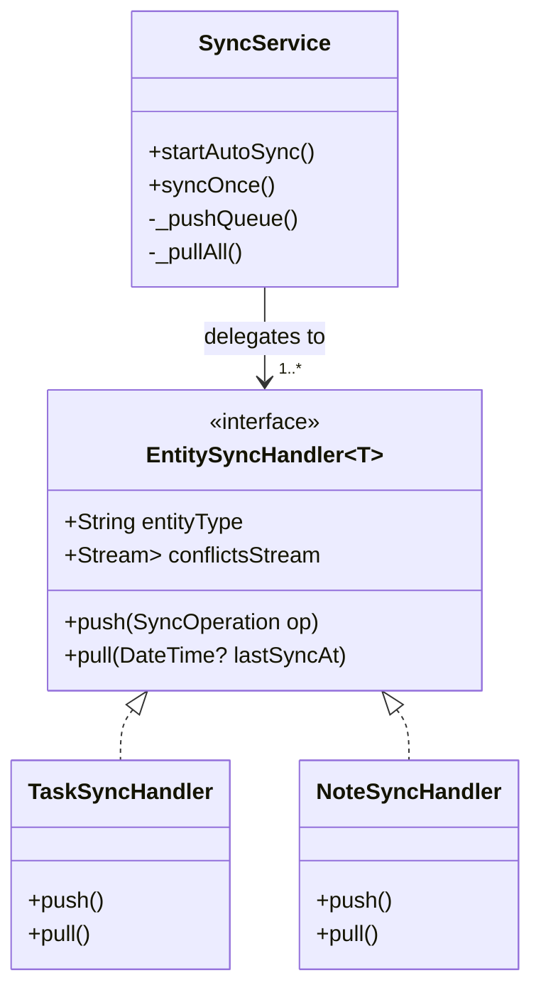

# Sync Architecture Reference

As of **February 2026** (v1.0), the synchronization engine has been refactored from a monolithic service into a modular **Strategy Pattern** design.

This ensures the `SyncService` remains lean and readable while allowing easy extension for new entity types (e.g., Habits, Reminders, Settings) without modifying core sync logic.

## 1. High-Level Diagram



## 2. Core Components

### A. Orchestrator (`SyncService`)

**Location**: `lib/core/services/sync/sync_service.dart`

The `SyncService` is now a dumb orchestrator. It knows **nothing** about "checking if a note is dirty" or "converting a task from Firestore JSON". Its job is solely:

1. **Queue Management**: Reads pending operations from Hive (`sync_ops` box).
2. **Connectivity**: Listens to network status and triggers auto-sync.
3. **Routing**:
    - During **Push**: Looks up `op.entityType` (e.g. 'task') to find the matching handler.
    - During **Pull**: Iterates through **all** registered handlers and calls `.pull()`.

### B. Strategy Interface (`EntitySyncHandler<T>`)

**Location**: `lib/core/services/sync/handlers/entity_sync_handler.dart`

The contract every feature must implement to participate in sync.

```dart
abstract class EntitySyncHandler<T> {
  String get entityType; // e.g., 'task'
  Stream<List<SyncConflict<T>>> get conflictsStream;
  Future<void> push(SyncOperation op);
  Future<void> pull(DateTime? lastSyncAt);
}
```

### C. Feature Handlers (`TaskSyncHandler`, `NoteSyncHandler`)

Handlers live inside their **feature directories**, not in `core/`:

- `TaskSyncHandler` → `lib/features/tasks/sync/task_sync_handler.dart`
- `NoteSyncHandler` → `lib/features/notes/sync/note_sync_handler.dart`

Each handler contains the specific business logic for its entity:

- **Collection References**: `_firestore.collection('tasks')`.
- **Deserialization**: `Task.fromFirestoreJson`.
- **Conflict Logic**: Using `TaskConflictDetector` or `NoteConflictDetector`.
- **Local Storage**: Creating/updating Hive items.

### D. Dependency Injection (Composition Root)

Handlers are **not** created inside `SyncService`. They are injected via the constructor at app startup.

The **Composition Root** is in `features/splash/`:

- [`app_initializer.dart`](../../features/splash/controllers/app_initializer.dart) — production startup
- [`provider_factory.dart`](../../features/splash/controllers/provider_factory.dart) — Provider tree wiring

```dart
final syncService = SyncService(
  connectivity: connectivity,
  handlers: [
    TaskSyncHandler(firestore: ..., deviceId: ...),
    NoteSyncHandler(firestore: ..., deviceId: ...),
  ],
);
```

This means `core/` has **zero imports** from `features/`. See [REF_DEPENDENCY_INJECTION.md](REF_DEPENDENCY_INJECTION.md) for the full DI guide.

## 3. How to Add a New Entity (e.g., Habits)

You do **not** need to touch `SyncService.dart`!

1. Create `lib/features/habits/sync/habit_sync_handler.dart` implementing `EntitySyncHandler<Habit>`.
2. Register it at the composition root (`app_initializer.dart` and `provider_factory.dart`):

    ```dart
    handlers: [taskHandler, noteHandler, habitHandler] // ← Just add here
    ```

3. Done — `SyncService` picks it up automatically via constructor injection.

## 4. Conflict Handling

Conflict logic remains strictly typed. Each handler exposes its own `Stream<List<SyncConflict<T>>>`. The `SyncController` listens to these individual streams and aggregates them for the UI.

- **Models**: `lib/core/services/sync/models/sync_conflict.dart`
- **Detectors**: `lib/core/utils/*_conflict_detector.dart`
